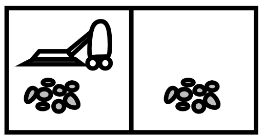

# Agentes Autônomos

<embed src="slides.pdf" type="application/pdf" width="600" height="300">

## Exemplo do aspirador de pó

Um robô aspirador de pó deve limpar uma casa com duas posições. As operações que ele sabe executar são:

* sugar
* ir para a posição da esquerda
* ir para a posição da direita



Em conjunto com todos os alunos vamos responder as seguintes perguntas: 

* O que é relevante representar nos estados do mundo? Como os estados são estruturados (estrutura de dados) e qual o significado dela (dos campos)?
* Quais são os **estados possíveis** do mundo do aspirador e as suas **transições**?
* Quais são as consequências das **ações** sobre os estados? As ações são determinísticas?
* É possível desenhar o **grafo** com todos os estados e transições para este problema? 
* Apresente uma solução possível. Uma sequência de ações que fazem o robô sair do estado inicial e chegar no estado final. 

Considere como estado final a situação ilustrada abaixo: 

 

??? warning "Conceitos que devem ser explorados neste exercício"

    Representação de um problema na forma de **estado**, **transição**, **grafo**

## Um grid world simples

Considere o ambiente representado abaixo, onde um agente pode se mover em quatro direções (cima, baixo, esquerda, direita) em um grid 3x3. O objetivo do agente é alcançar a célula marcada com "G" (goal). A célula marcada com "A" é a posição do agente.

```
+---+---+---+
| A |   |   |
+---+---+---+
|   |   |   |
+---+---+---+
|   |   | G |
+---+---+---+
```

Individualmente, responda as seguintes perguntas:

* O que é relevante representar nos estados do mundo? Como os estados são estruturados (estrutura de dados) e qual o significado dela (dos campos)?
* Quais são os **estados possíveis** do mundo?
* Quais são as consequências das **ações** sobre os estados? As ações são determinísticas?
* O que caracteriza um estado como estado final?
  
Ao terminar, entregue suas respostas no formulário disponibilizado pelo professor.