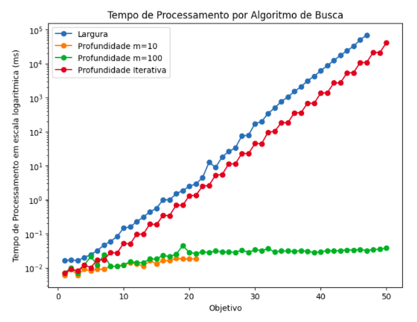

# Algoritmos de Busca em Largura, Profundidade e Profundidade Iterativa

Nas aulas anteriores implementamos um agente aspirador de pó. Na última aula executamos os algoritmos de Busca em Largura e Profundidade e discutimos alguns conceitos relacionados a esses algoritmos. Nesta aula vamos explicar com mais detalhes e de forma mais estruturada como esses algoritmos funcionam.

??? hint "Objetivo desta aula"
    O objetivo desta aula é entender como os algoritmos de busca em largura, profundidade e profundidade iterativa funcionam.

??? hint "Ao final desta aula..."

    Ao final desta aula você deverá saber a diferença entre os algoritmos de busca: 

    * em largura;
    * em profundidade, e;
    * em profundidade iterativa.

??? hint "Além disso..."

    Além disso você também deverá saber como avaliar um algoritmo de busca, quais indicadores utilizar, e, consequentemente, saber como aplicá-los nos problemas apresentados. 

## Material utilizado

O material utilizado para esta aula está nos slides 17 até 28 do conjunto de slides abaixo: 

<embed src="../../referencias/03_algoritmos_busca/busca_versaoFabricio.pdf" type="application/pdf" width="600" height="300">

## Atividade de laboratório

Um robô elevador está programado para transportar cargas dentro de um armazém vertical. Ele começa no térreo (andar 0) e pode realizar duas operações para se mover entre os andares:

* Subir 1 andar: o elevador move-se do andar $A = A+1$.
* Subir 2 andares: o elevador move-se do andar $A = A+2$.

O objetivo do robô é alcançar um andar específico $A_{f}$, definido pelo usuário.

Implemente um agente chamado `Elevador` que resolve este problema utilizando os algoritmos de busca em largura, busca em profundidade e busca em profundidade iterativa.

Este robô sabe executar duas ações: "subir 1 andar" e "subir 2 andares". Na sua implementação você deve usar exatamente este nome para as ações. No método `successors` você deve primeiro adicionar a ação "subir 2 andares" e depois a ação "subir 1 andar".

Este exercício é composto por algumas partes: implementando o agente com os algoritmos e avaliando o comportamento do agente. 

### Implementando o agente

Você deve implementar um arquivo `Elevador.py` com uma função `main(inicio, objetivo, algoritmo)` que recebe 3 parâmetros: o andar de início, o andar objetivo e o algoritmo que será utilizado. O parâmetro algoritmo aceita três valores: BL, BP, BPI. Estes valores representam os algoritmos de busca em largura, busca em profundidade e busca em profundidade iterativa, respectivamente. A sua implementação deve passar por todos os testes do arquivo `test_elevador.py`. 

Esta primeira parte é pré-requisito da segunda parte. Se na entrega esta parte não estiver implementada, a segunda parte não será avaliada.

### Avaliando o comportamento do agente

Utilize este código para testar os três algoritmos vistos até o momento (busca em largura, busca em profundidade e busca em profundiade iterativo) variando o estado final de $1$ até $50$. No caso do algoritmo em profundidade, teste duas versões ($m = 10$ e $m = 100$).

Armazene o tempo de processamento criando uma tabela similar a esta: 

| Algoritmo | Objetivo | Tempo de processamento em segundos |
|:----------|:--------:|:----------------------:|
| Busca em Largura | 1 | 0.000036 |
| Busca em Largua | $\cdots$ | $\cdots$ |
| Busca em Largura| 10 | 0.000378 |
| Busca em Largura | 50 | $\cdots$ | 
| Busca em Profundidade com $m= 10$ | 1 | 0.000033 |
| Busca em Produndidade com $m= 10$ | $\cdots$ | $\cdots$ |
| Busca em Produndidade com $m= 100$ | $\cdots$ | $\cdots$ |
| Busca em Profundidade Iterativa |  1 | $\cdots$ |
| Busca em Profundidade Iterativa |  $\cdots$ | $\cdots$ |
| Busca em Profundidade Iterativa |  50 | $\cdots$ |

Em alguns casos a combinação do algoritmo com o objetivo não fornece um resultado. Você deve informar na tabela estes casos. Nestas situações você deve colocar o tempo de processamento como NaN, ou seja, valor faltante. De forma alguma você pode colocar o valor zero nestas situações. Utilize os conhecimentos adquiridos na disciplina de Ciência de Dados do semestre passado e faça um *plot* destes dados em um único gráfico. 

**Em um documento, coloque a tabela, o gráfico e responda as seguintes perguntas**: 

* Segundo o que discutimos em sala de aula, quais destes algoritmos são **ótimos**? Os resultado encontrados neste exercício são coerentes com está informação? Justifique a sua resposta.

* Segundo o que discutimos em sala de aula, quais destes algoritmos são **completos**? Os resultado encontrados neste exercício são coerentes com está informação? Justifique a sua resposta.

* Teve algum algoritmo que travou por falta de memória no seu computador? Se sim, qual é a explicação?

### Entrega 

Esta atividade é individual e deve ser submetida via Github Classroom. O link para a atividade é [https://classroom.github.com/a/3HHDtNJo](https://classroom.github.com/a/3HHDtNJo). O prazo para entrega é **24/02/2025**. 

### Rubrica de avaliação

| Conceito | Descrição |
|:--------:|:----------|
| A+       | Submeteu um documento que apresenta a tabela completa, responde todas as perguntas de forma correta e apresenta um único *plot* que sumariza todos os dados de forma correta e objetiva.|
| A        | Submeteu um documento que apresenta a tabela completa, responde todas as perguntas de forma correta e apresenta o *plot*, mas este plot poderia ser melhor feito.| 
| C        | Submeteu um documento que apresenta a tabela, mas não responde todas as perguntas de forma correta ou não apresenta o *plot*.|
| D        | A implementação passou por todos os testes.|
| I        | A implementação não passou por todos os testes.|   

<!--
## Comentários sobre os trabalhos entregues :new:

Pessoal, 

Seguem dois exemplos de plots bem formados e completos: 

Estes dois *plots* sumarizam muito os experimentos feitos. Principalmente o *plot* com escala logaritmica. Nele é possível perceber a diferença de tempo de processamento e também quando os algoritmos param de responder. 

--> 