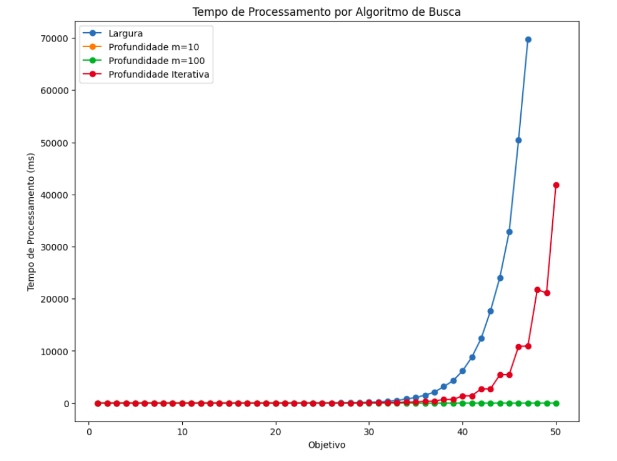

# Algoritmos de Busca em Largura e Profundidade

??? hint "Ao final desta aula..."

    Ao final desta aula você deverá saber a diferença entre os algoritmos de busca: 

    * em largura;
    * em profundidade, e;
    * em profundidade iterativa.

??? hint "Além disso..."

    Além disso você também deverá saber como avaliar um algoritmo de busca, quais indicadores utilizar, e, consequentemente, saber como aplicá-los nos problemas apresentados. 


O material utilizado para esta aula está nos slides 17 até 28 do conjunto de slides abaixo: 

<embed src="../../referencias/03_algoritmos_busca/busca_versaoFabricio.pdf" type="application/pdf" width="600" height="300">

## Atividade de laboratório

Considere um agente que recebe um número inteiro inicial, geralmente $n = 1$, e que sabe executar duas ações: 

* **soma 1**: onde gera um estado filho cujo $n = n + 1$, e;
* **soma 2**: onde gera um estado filho cujo $n = n + 2$. 

Este agente precisa encontrar uma sequência de ações que leve ele do estado inicial, geralmente $n = 1$, até um estado final ($n > 1$) informado pelo usuário. 

Ou seja, trata-se de um problema com ramificação igual a $2$ e uma profundidade que pode variar de acordo com o valor informado pelo usuário. 

Uma implementação possível para este problema usando a biblioteca `aigyminsper` é apresentada abaixo: 

```python
from aigyminsper.search.SearchAlgorithms import BuscaLargura
from aigyminsper.search.SearchAlgorithms import BuscaProfundidade
from aigyminsper.search.SearchAlgorithms import BuscaProfundidadeIterativa
from aigyminsper.search.Graph import State
from datetime import datetime

class SumOne(State):

    def __init__(self, n, op, g):
        self.operator = op
        self.number = n
        self.goal = g
    
    def successors(self):
        sucessors = []
        if self.number < self.goal:
            sucessors.append(SumOne(self.number+1, "+1 ", self.goal))
            sucessors.append(SumOne(self.number+2, "+2 ", self.goal))
        return sucessors
    
    def is_goal(self):
        if self.goal == self.number:
            return True
        return False
    
    def description(self):
        return "Este é um agente simples que sabe somar 1 e 2"
    
    def cost(self):
        return 1

    def env(self):
        return self.number

def main():
    objetivo = int(input('Digite o valor objetivo: '))
    state = SumOne(1, '', objetivo)
    algorithm = BuscaLargura()
    #algorithm = BuscaProfundidade()
    #algorithm = BuscaProfundidadeIterativa()
    start_time = datetime.now()
    result = algorithm.search(state)
    end_time = datetime.now()
    print(f'Tempo de processamento = {end_time - start_time}')
    if result != None:
        print('Achou!')
        print(result.show_path())
    else:
        print('Nao achou solucao')

if __name__ == '__main__':
    main()
```

Utilize este código para testar os três algoritmos vistos até o momento (busca em largura, busca em profundidade e busca em profundiade iterativo) variando o estado final de $1$ até $50$. 

No caso do algoritmo em profundidade, teste duas versões ($m = 10$ e $m = 100$).

Armazene o tempo de processamento criando uma tabela similar a esta: 

| Algoritmo | Objetivo | Tempo de processamento |
|:----------|:--------:|:----------------------:|
| Busca em Largura | 1 | 0:00:00.000036 |
| Busca em Largua | $\cdots$ | $\cdots$ |
| Busca em Largura| 10 | 0:00:00.000378 |
| Busca em Largura | 50 | $\cdots$ | 
| Busca em Profundidade com $m= 10$ | 1 | 0:00:00.000033 |
| Busca em Produndidade com $m= 10$ | $\cdots$ | $\cdots$ |
| Busca em Produndidade com $m= 100$ | $\cdots$ | $\cdots$ |
| Busca em Profundidade Iterativa |  1 | $\cdots$ |
| Busca em Profundidade Iterativa |  $\cdots$ | $\cdots$ |
| Busca em Profundidade Iterativa |  50 | $\cdots$ |

Em alguns casos a combinação do algoritmo com o objetivo não fornece um resultado. Você deve informar na tabela estes casos. 

Utilize os conhecimentos adquiridos na disciplina de Ciência de Dados do semestre passado e faça um *plot* destes dados em um único gráfico. 

Em um documento, coloque a tabela, o gráfico e responda as seguintes perguntas: 

* Segundo o que discutimos em sala de aula, quais destes algoritmos são **ótimos**? Os resultado encontrados neste exercício são coerentes com está informação? Justifique a sua resposta.

* Segundo o que discutimos em sala de aula, quais destes algoritmos são **completos**? Os resultado encontrados neste exercício são coerentes com está informação? Justifique a sua resposta.

* Teve algum algoritmo que travou por falta de memória no seu computador? Se sim, qual é a explicação?

* Qual é o algoritmo que tem um tempo de processamento menor? Justifique a sua resposta. 

Esta atividade é individual. O arquivo criado deve ser submetido no Blackboard. A atividade já está disponível no Blackboard e o prazo para entrega é até amanhã, dia **27/02/2024** (terça-feira) até às 23:30 horas.

## Rubrica de avaliação

| Conceito | Descrição |
|:--------:|:----------|
| A+       | Submeteu um documento que apresenta a tabela completa, responde todas as perguntas de forma correta e apresenta um único *plot* que sumariza todos os dados de forma correta e objetiva.|
| A        | Submeteu um documento que apresenta a tabela completa, responde todas as perguntas de forma correta e apresenta o *plot*, mas este plot poderia ser melhor feito.| 
| C        | Submeteu um documento que apresenta a tabela, mas não responde todas as perguntas de forma correta ou não apresenta o *plot*.|
| D        | Submeteu um documento, mas o mesmo não responde todas as perguntas de forma correta e também não apresenta a tabela completa ou *plot*.|   

<!--
## Comentários sobre os trabalhos entregue :new:

Pessoal, 

Depois de avaliar os trabalhos entregues por vocês, gostaria de fazer os seguintes comentários: 

* sempre é bom persistir os resultados das simulações. Desta maneira você ou outra pessoa não precisam re-executar novamente todos os experimentos. Para persistir os dados talvez a forma mais simples seja armazenando os dados em um CSV. 

* se você persistir os dados então você deve sempre enviar os dados junto com o relatório. Não adianta persistir os dados e não encaminhar eles junto com o relatório. 

* quando uma simulação não termina (por excesso de tempo ou estouro de memória) vocês não podem colocar zero para o tempo de processamento. Vocês devem sempre colocar algo como valor faltante (NA) ou outro indicador de que este dado não foi possível de ser gerado. 

Além disso, seguem dois exemplos de plots bem formados e completos: 




Estes dois *plots* sumarizam muito os experimentos feitos. Principalmente o *plot* com escala logaritmica. Nele é possível perceber a diferença de tempo de processamento e também quando os algoritmos param de responder. 

-->