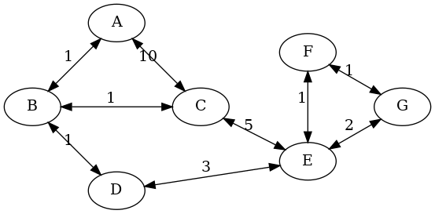

# Continuação sobre algoritmos de busca

O objetivo da aula de hoje é implementar agentes capazes de resolver os problemas abaixo. 

## O homem, o lobo, o carneiro e o cesto de alface

Uma pessoa, um lobo, um carneiro e um cesto de alface estão à beira de
  um rio. Dispondo de um barco no qual pode carregar apenas um dos
  outros três, a pessoa deve transportar tudo para a outra margem.
  Determine uma série de travessias que respeite a seguinte condição:
  em nenhum momento devem ser deixados juntos e sozinhos o lobo e o
  carneiro ou o carneiro e o cesto de alface.

## Banda U2

A banda U2 tem um concerto que começa daqui a 17 minutos e
  todos precisam cruzar uma ponte par chegar lá. Todos os 4
  participantes estão do mesmo lado da ponte. É noite. Só
  há uma lanterna. A ponte suporta, no máximo, duas
  pessoas. Qualquer pessoa que passe, uma ou duas, deve passar com a
  lanterna na mão. A lanterna deve ser levada de um lado para outro
  e não ser jogada. Cada membro da banda tem um tempo diferente
  para passar de um lado para o outro. O par deve andar no tempo do
  menos veloz: Bono: 1 minuto para passar; Edge: 2 minutos para
  passar; Adam: 5 minutos para passar; e Larry: 10 minutos para
  passar.

O problema consiste em ter os quatro elementos da banda do outro lado
da ponte no menor tempo possível.

??? warning "Tem algo dirente neste problema..." 
    O que é diferente neste problema em relação aos outros?


<!--

## Cavalo e tabuleiro de xadrez

Considerando um tabuleiro de xadrez (`8x8`) com um
  único cavalo, quais os movimentos que o cavalo deve fazer para
  percorrer todas as posições do tabuleiro uma única vez e
  retornar ao ponto de partida?

## As 8 rainhas

Coloque oito rainhas em um tabuleiro de
  xadrez (`8x8` casas) de maneira que nenhuma rainha ameace
  outra, i.e., as rainhas não devem compartilhar colunas, linhas ou
  diagonais do tabuleiro.

-->

## Procurando caminhos em um mapa

Considere o mapa abaixo: 



Os $nodos = \{A,B,C,D,E,F,G\}$ são locais. As arestas são as ligações entre os locais. Cada aresta tem um custo. Por exemplo, O caminho entre A e B tem custo 1. O caminho entre A e C tem custo 10. Este é um grafo bi-direcional. Ou seja, O custo de A para C é o mesmo de C para A.

Implemente uma solução que é capaz de encontrar o menor caminho entre qualquer par de locais do mapa. 

## Aspirador de Pó em uma casa genérica.

Neste exercício o agente sabe executar outras ações, mas o objetivo dele permanece o mesmo. As ações são: 

* ir para frente;
* virar para a esquerda;
* virar para a direita, e;
* limpar

As características da casa são definidas via arquivo de configuração. Por exemplo, o arquivo abaixo: 

```
0;0;0;0
0;0;1;0
0;0;0;0
```

É uma casa com $3 \times 4$ quartos. O número 1 indica que o quarto está sujo.

Implemente um agente que recebe os seguintes parâmetros: 

```
VacuumWorldGeneric(mapa, lin, col, "")
```

e consiga encontrar uma solução para todos os casos de testes apresentados no projeto. `mapa` é o mapa da casa, `lin` é a linha onde o agente inicia e `col` é a coluna onde o agente inicia. 

* Será que o algoritmo de busca vistos até o momento conseguem encontrar respostas para todas as configurações iniciais? 


??? "Questão"
    
    Será que é possível utilizar outros algoritmos? 


## Exercício de implementação

Implemente todos os agentes acima no projeto [https://classroom.github.com/a/nKr94eGa](https://classroom.github.com/a/nKr94eGa). Respeite as interfaces definidas no projeto. Em especial, nos arquivos de teste. Quando você implementar soluções que conseguem passar em todos os testes então submeta via Github Classroom. Esta submissão deve ser feita em duplas até o dia 06/09/2024. 

## Material de referência

* Capítulo 3: Solving Problems by Searching do livro do Russel e Norvig. 

* [Slides da disciplina](../../referencias/03_algoritmos_busca/busca_versaoFabricio.pdf)
