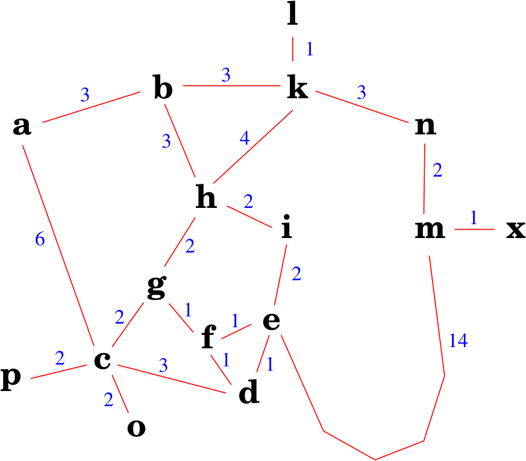

# Menor caminho entre duas cidades

Considere o mapa abaixo: 



Implemente um agente autônomo que consegue resolver este problema. Antes de iniciar a implementação, pense na resposta para as seguintes perguntas: 

* O que é relevante representar nos estados do mundo? Como os
    estados são estruturados (estrutura de dados) e qual o significado
    dela (dos campos)?
* Mostre como ficam representados os estados inicial e final
    segundo a representação adotada.
* Quais as operações sobre os estados?
    (detalhe como cada operação irá alterar os estados e quais as
    condições para cada operação ser executada)
* Qual a estimativa do tamanho do espaço de busca (número de
    estados possíveis)?
* Que algoritmo de busca pode ser utilizado para resolver este problema considerando que
a solução apresentada precisa ser ótima?

## Sugestão de codificação do mapa

Considere a definição abaixo como mapa para a sua implementação:

```python
    @staticmethod
    def createArea():

        Mapa = {
            'a':[(3,'b'),(6,'c')],
            'b':[(3,'a'),(3,'h'),(3,'k')],
            'c':[(6,'a'),(2,'g'),(3,'d'),(2,'o'),(2,'p')],
            'd':[(3,'c'),(1,'f'),(1,'e')],
            'e':[(2,'i'),(1,'f'),(1,'d'),(14,'m')],
            'f':[(1,'g'),(1,'e'),(1,'d')],
            'g':[(2,'c'),(1,'f'),(2,'h')],
            'h':[(2,'i'),(2,'g'),(3,'b'),(4,'k')],
            'i':[(2,'e'),(2,'h')],
            'l':[(1,'k')],
            'k':[(1,'l'),(3,'n'),(4,'h'),(3,'b')],
            'm':[(2,'n'),(1,'x'),(14,'e')],
            'n':[(2,'m'),(3,'k')],
            'o':[(2,'c')],
            'p':[(2,'c')],
            'x':[(1,'m')]
            }
```


## Implementações

Implemente um agente, usando o algoritmo de **busca em largura**, para encontrar um caminho entre a cidade *i* e *o*. 

Perguntas:

* Qual foi o tempo de processamento até a implementação encontrar uma solução? 
* Qual é o tamanho da árvore de busca gerada? O algoritmo abre muitos nodos de forma desnecessária? 
* A solução encontrada é ótima? 

Usando a mesma implementação, encontre um caminho entre a cidade *b* e *o*. 

Perguntas:

* Qual foi o tempo de processamento até a implementação encontrar uma solução? 
* Qual é o tamanho da árvore de busca gerada? O algoritmo abre muitos nodos de forma desnecessária? 
* A solução encontrada é ótima?


## Usando o algoritmo de custo uniforme

Utilize o algoritmo de custo uniforme para encontrar uma solução para os problemas abaixo: 

* da cidade *i* para a cidade *o*
* da cidade *b* para a cidade *o*
* da cidade *i* para a cidade *x*

Perguntas:

* Qual foi o tempo de processamento até a implementação encontrar uma solução? 
* Qual é o tamanho da árvore de busca gerada? O algoritmo abre muitos nodos de forma desnecessária? 
* A solução encontrada é ótima?


## Entendendo a busca que o algoritmo faz

Para entendermos melhor o que está acontecendo, segue a implementação da **Busca de Custo Uniforme**: 

```python
class BuscaCustoUniforme (SearchAlgorithm):

    def search (self, initialState, trace=False):
        open = []
        new_n = Node(initialState, None)
        open.append((new_n, new_n.g))
        while (len(open) > 0):
            #list sorted by g()
            open.sort(key = sortFunction, reverse = True)
            n = open.pop()[0]
            if trace: print(f'Estado = {n.state.env()} com custo = {n.g}') 
            if (n.state.is_goal()):
                return n
            for i in n.state.sucessors():
                new_n = Node(i,n)
                open.append((new_n,new_n.g))
        return None
```

Ao executar: 

```python
    state = Map('i', 0, 'i', 'x')
    algorithm = BuscaCustoUniforme()
    ts = time.time()
    result = algorithm.search(state, trace=True)
    tf = time.time()
```

O algoritmo abriu muitos nodos de forma desnecessária? 

<!--

## Entrega do exercício

* Para a implementação e entrega deste exercício nós vamos utilizar o [Github Classroom](https://classroom.github.com/a/OQePW2ai). 

* Você deve criar um projeto e entregar um arquivo python com a implementação e um arquivo `README.md` com as respostas das perguntas acima.

* Esta implementação pode ser feita em grupo de até 3 pessoas.

* **Prazo para a entrega**: 10/03/2024 (domingo) até às 23:30 horas.

-->

## Usando heurísticas para otimizar a busca na árvore

??? warning "O que é uma heurística?"
    O que é uma heurística? 

??? warning "Qual é a utilidade de uma heurística?"
    Qual é a utilidade de uma heurística? 

??? warning "Que heurística podemos usar no problema das cidades?"
    Que heurística podemos usar no problema das cidades? 
 

Para responder as perguntas acima considere o slide 32 em diante: 

<embed src="../../referencias/03_algoritmos_busca/busca_versaoFabricio.pdf" type="application/pdf" width="600" height="300">

<!-- ## Implementando o problemas das cidades com heurística

Faça `pull` do projeto [https://github.com/Insper/ai_code](https://github.com/Insper/ai_code) e termine de codificar o arquivo `Map.py`.

Execute a implementação considerando os algoritmos:

* Busca Gananciosa
* A* (AEstrela)

-->