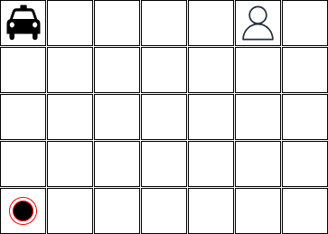

# Heurística admissível

No problema apresentado na [aula passada](../08_heuristica/index.md) teve alguma situação onde o **algoritmo A*** não encontrou a solução ótima?

??? question "Resposta"
    Sim, quando a heurística não é admissível.

??? info "Dica" 
    A heurística é admissível quando ela nunca superestima o custo para alcançar o objetivo.

## Problemas

### Problema do Taxi Driver

Considere um agente que precisa levar um passageiro de um ponto A para um ponto B como apresentado no mapa abaixo: 

Neste mapa o taxi está na posição [0,0], o passageiro está na posição [0,5] e o destino do passageiro está na posição [4,0]. O agente pode se mover em qualquer direção (esquerda, direita, cima, baixo), mas apenas uma casa por vez. O custo para se mover de uma casa para outra é 1. O agente também tem como ação pegar e deixar o passageiro. O custo para pegar o passageiro é 2 e o custo para deixar o passageiro é 0. O objetivo do agente é levar o passageiro até o destino com o menor custo possível.

Para as dimensões apresentadas acima talvez algoritmos de busca cegos poderiam ser utilizados. No entanto, considerando um mapa maior algoritmos de busca cegos não seriam uma boa opção.

**O que é necessário fazer para implementar uma solução que sempre fornece uma solução ótima para o problema? Independente das dimensões do mapa?**

### 8-Puzzle

Defina uma ou mais heurísticas admissíveis para o problema do [8-puzzle](https://www.aiai.ed.ac.uk/~gwickler/eightpuzzle-inf.html).

Esta mesma heurística pode ser utilizada para o problema do [15-puzzle](https://en.wikipedia.org/wiki/15_puzzle)?

O que muda do problema do 8-puzzle para o 15-puzzle?

### Cavalo e tabuleiro de xadrez

Considerando um tabuleiro de xadrez (`8x8`) com um
  único cavalo, quais os movimentos que o cavalo deve fazer para
  percorrer todas as posições do tabuleiro uma única vez e
  retornar ao ponto de partida?

