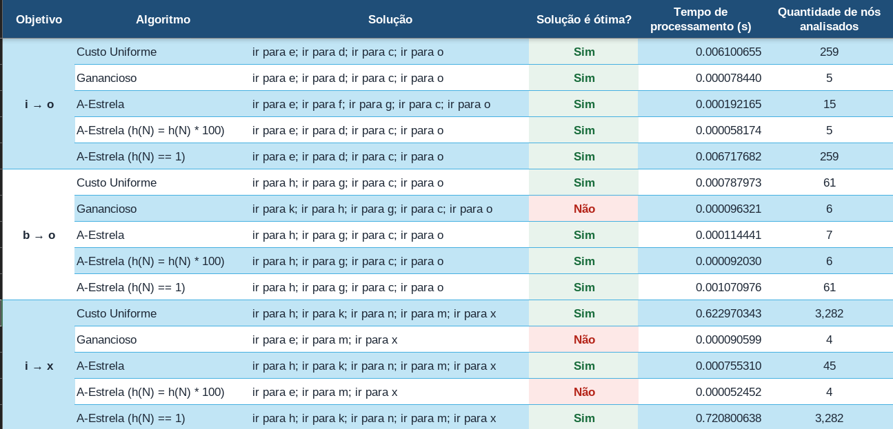

# Resultados da atividade de busca em mapas

Na figura abaixo, são apresentados os resultados da atividade de busca em mapas com os algoritmos BCU, BG e A*. 

Levando-se em consideração os resultados apresentados, discutam as seguintes questões em sala de aula: 

1. Qual algoritmo sempre encontrou o melhor caminho?
2. Qual algoritmo foi mais eficiente em termos de uso de memória?

## Considerando o algoritmo A*

1. qual heurística retornou a melhor solução e foi mais eficiente em termos de uso de memória?
2. qual heurística retornou a melhor solução e não foi eficiente em termos de uso de memória?
3. qual heurística não retornou solução ótima? 
4. Por que o algoritmo A* teve comportamento diferente dependendo da heurística utilizada? 

??? info "Conceito importante!" 
    A heurística é admissível quando ela nunca superestima o custo para alcançar o objetivo.

