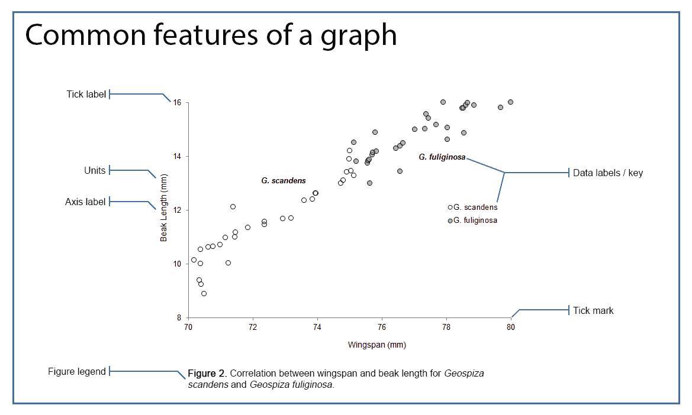
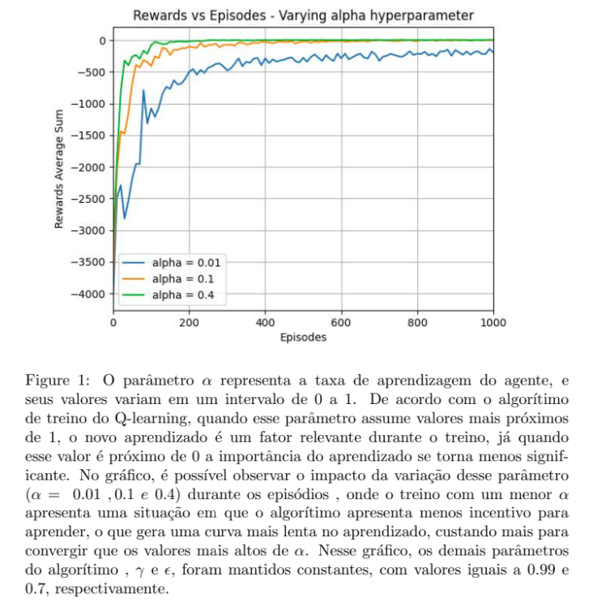
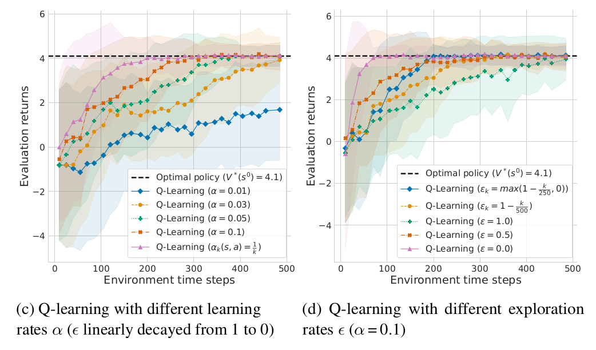

# Hiperparâmetros no Q-Learning

Ainda considerando o exemplo a implementação do `TaxiDriver`, responda as perguntas abaixo.

Para responder as questões abaixo utilize as implementações do `TaxiDriverGym.py` e o arquivo `QLearning.py` que você implementou na atividade anterior.

## Manipulando $\alpha$ e $\gamma$

* Se $\alpha$ for um valor muito próximo de zero? Explique o comportamento encontrado.

* Se $\gamma$ for zero? Explique o comportamento encontrado. 

Para fundamentar a sua resposta, use os plots gerados na pasta `results` depois do treinamento. 

## Considerando uma escolha de ação sempre aletatória

O que acontece se a escolha das ações em cada estado for sempre aleatória? Ou seja, se a função `select_action` ao invés de ser definida como abaixo:

````python
def select_action(self, state):
    rv = random.uniform(0, 1)
    if rv < self.epsilon:
        return self.env.action_space.sample() # Explore action space
    return np.argmax(self.q_table[state]) # Exploit learned values
````

É definida assim:

````python
def select_action(self, state):
    return self.env.action_space.sample() # Explore action space
````

Qual o comportamento do agente? **Novamente**: use os plots gerados na pasta `results` depois do treinamento para fundamentar a sua resposta. 

## Considerando um agente que nunca explora novas ações

O que acontece se a escolha das ações em cada estado for sempre buscando a melhor ação? Ou seja:

````python
def select_action(self, state):
    return np.argmax(self.q_table[state]) # Exploit learned values
````  

## Sumarizando os resultados através de imagens

Como podemos sumarizar os diferentes resultados através de imagens?

Neste momento, você já deve ter percebido que uma ferramenta muito útil para visualizar e sumarizar o aprendizado do agente são gráficos que mostram a evolução de alguma métrica ao longo dos diversos episódios.

* Quais foram as métricas utilizadas no caso do `TaxiDriver`?

* Quais foram os hiperparâmetros utilizados? 

* O aprendizado dos agentes implementados para este caso **convergem** rapidamente? 

* O **desempenho** do agente se mantem ao longo dos episódios? 

## Atividade

Você deve entregar um arquivo `README.md` que responde as seguintes perguntas: 

* Qual é o impacto de $\alpha$? Faça um gráfico com a curva de aprendizado do agente fixando $\gamma$ e variando $\alpha$. A sugestão é utilizar três (3) valores para $\alpha$: um próximo de zero, um intermediário e um próximo de um (1). Utilize um único gráfico com as três curvas de aprendizado.

* Qual é o impacto de $\gamma$ no aprendizado do agente no ambiente `TaxiDriver`? Faça um gráfico com a curva de aprendizado do agente fixando $\alpha$ e variando $\gamma$. A sugestão é utilizar três (3) valores para $\gamma$: um próximo de zero, um intermediário e um próximo de um (1). Utilize um único gráfico com as três curvas de aprendizado.

* Qual é o impacto da forma como a ação é escolhida durante o treinamento? Faça um gráfico com a curva de aprendizado do agente usando três curvas: (i) onde o agente apenas explora o ambiente, ou seja, seleciona de forma aleatória todas as ações durante o treinamento; (ii) onde o agente apenas se utiliza do seu conhecimento sobre o ambiente, ou seja, na maioria das vezes faz o *explotation* ao invés do *exploration*. Para este caso, crie uma função de escolha da ação onde o agente tem probabilidade de 90% para escolher uma ação de acordo com a *q-table* e os outros 10% são aleatórios; (iii) onde o agente faz uso de uma função de *exploration and explotation* com um decaimento do $\epsilon$. 

**Apresente os 3 gráficos no arquivo de `README.md`. Submeta este arquivo no repositório do projeto junto com os outros artefatos (scripts, dados e figuras). Este projeto é em grupo com até 3 pessoas e deve ser submetido neste link: [https://classroom.github.com/a/4rdGfqhx](https://classroom.github.com/a/4rdGfqhx).**

### Exemplo de gráfico

Um exemplo de imagem [^1] que sumariza dados ou apresenta resultados de experimentos é apresentada abaixo: 

<!--

-->

<center>

</center>

Todas as informações relevantes para entender o resultado do treinamento precisam estar auto-contidas na imagem e na legenda da imagem. 

<!--Um documento com esta imagem e legenda deve ser entregue via Blackboard até o dia **02/03/2023**. A atividade já foi criada no Blackboard e o nome dela é *Q-Learning with hyperparameters*. Esta atividade é individual.

## Rubrica de avaliação

| Conceito | Descrição |
| A+       | Entregou uma única imagem com legenda. O texto da legenda possui toda a informação necessária para entender os resultados alcançados pelo experimento. A imagem é uma imagem que consegue mostrar a diferença entre os hiperparâmetros escolhidos |
| C        | Não entregou uma única imagem |

## Um exemplo de gráfico muito bem feito :new: 

Segue abaixo um exemplo de gráfico muito bem formatado e completo. Este gráfico foi feito pela Letícia. 

<center>

</center>

-->

Outro exemplo de gráfico muito bem feito é apresentado abaixo [^2]:




[^1]: Este gráfico foi feito pela Letícia, aluna de Engenharia da Computação, durante a disciplina eletiva de *Reinforcement Learning*.  
[^2]: Stefano V. Albrecht, Filippos Christianos, and Lukas Schäfer. [Multi-Agent Reinforcement Learning: Foundations and Modern Approaches](https://www.marl-book.com/). MIT Press, 2024.