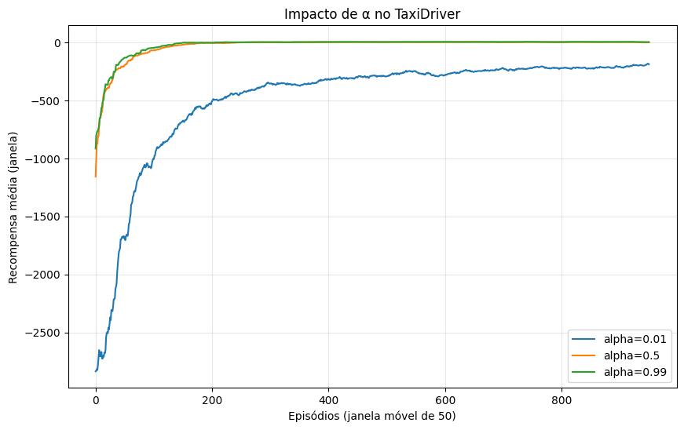
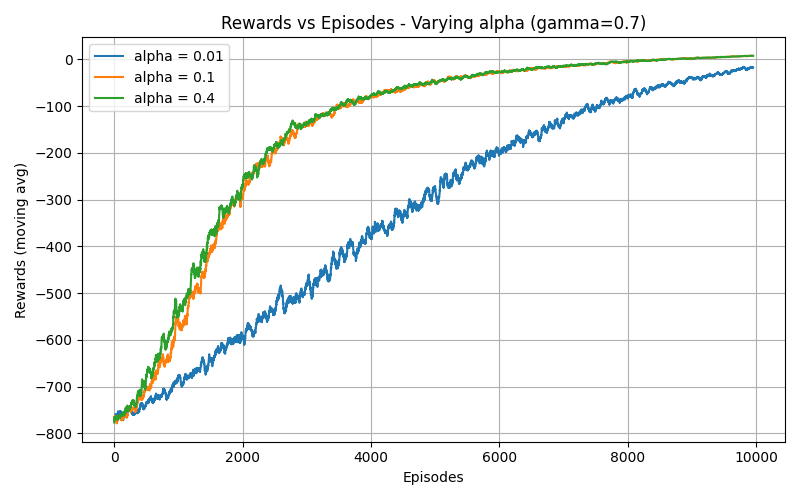
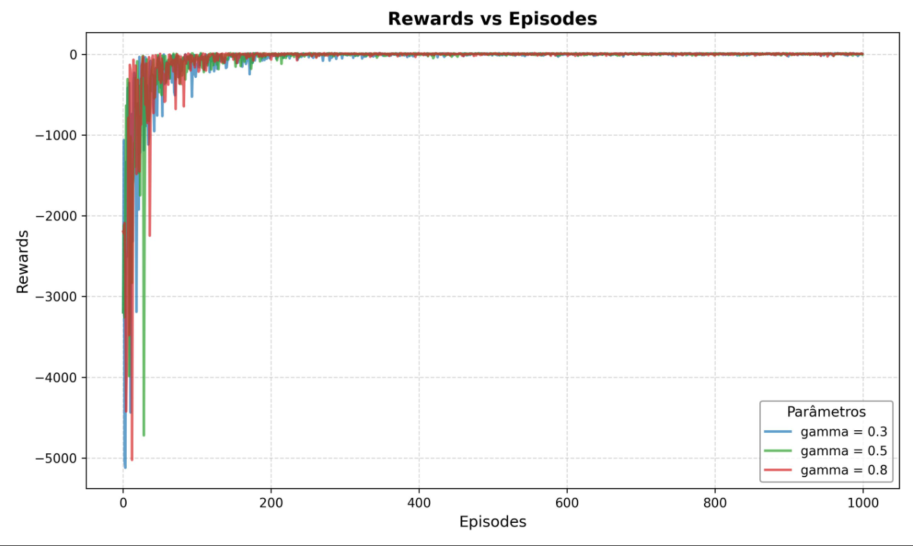
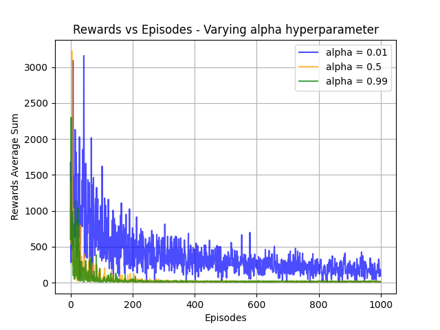
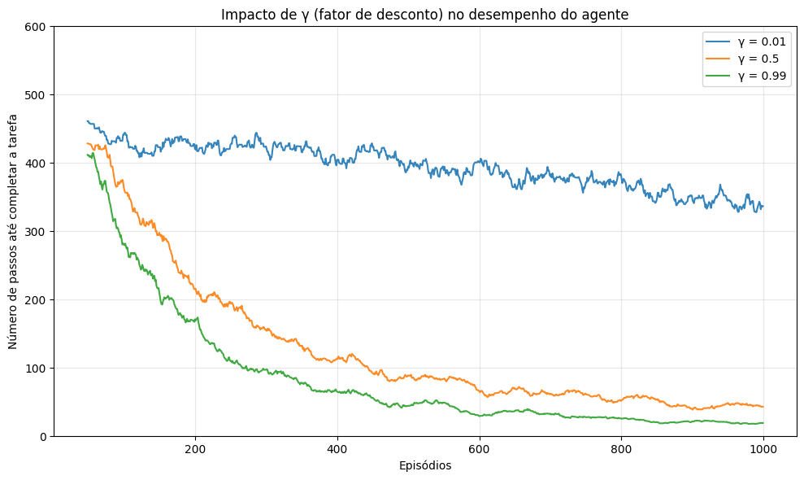
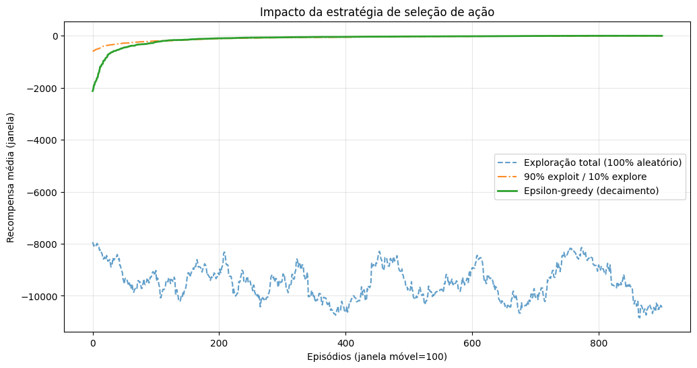

# Análise dos gráficos de curva de aprendizado

Ao analisar os gráficos abaixo, além de responder as perguntas propostas, reflita sobre a corretude dos dados apresentados nos gráficos. 

* Levando-se em consideração o gráfico acima, qual é o melhor $\alpha$ para o ambiente do TaxiDriver?

* O gráfico acima também mostra a curva de aprendizado para diferentes valores de $\alpha$. Por que esta curva é diferente da anterior?

* O gráfico acima mostra a curva de aprendizado para diferentes valores de $\gamma$. Qual é o melhor valor de $\gamma$ para o ambiente do TaxiDriver? É possível responder esta pergunta apenas olhando para o gráfico?

* O que tem de diferente neste gráfico em relação aos anteriores? 

* O que tem de diferente neste gráfico em relação aos anteriores? 

* O agente que fez uso de uma seleção de ações totalmente aleatória durante o treinamento conseguiu aprender a resolver o ambiente do TaxiDriver? 

