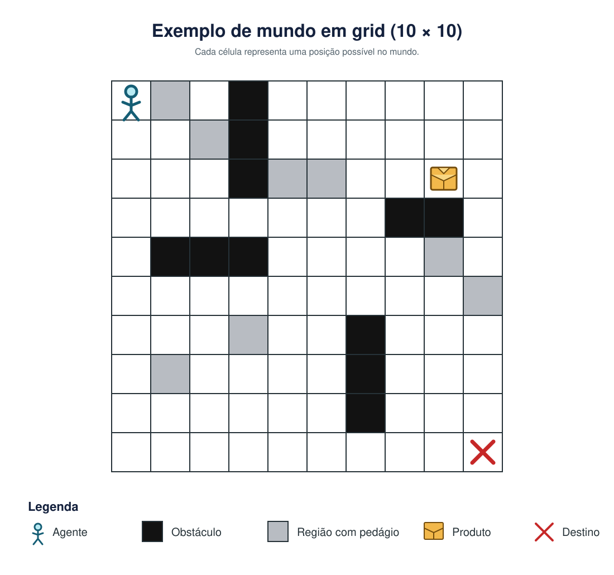

# Questão retirada da prova

Considere um mundo na forma de um *grid* (Figura 1). Neste mundo existe um único agente (representado por um boneco), algumas células que são impossíveis de passar (pintadas em preto), algumas células que são anotadas como regiões com pedágio (pintadas em cinza), um produto que precisa ser pego em uma determinada célula (representado por uma caixa) e outra célula que é o destino da entrega (representada com um X). Este grid sempre vai ser quadrado, mas a dimensão dele pode ser diferente a cada execução.

Cada vez que o mundo é inicializado, a posição do agente, dos obstáculos, das células com pedágio, do pacote e do local de entrega podem mudar. A dimensão é um argumento definido pelo usuário.

O agente sabe executar as seguintes ações: ir para cima, ir para baixo, ir para esquerda, ir para direita, pegar pacote e entregar pacote. A ação de ir para cima faz o agente andar uma célula para cima. A ação de ir para baixo faz o agente andar uma célula para baixo. A ação de ir para esquerda faz o agente andar uma célula para a esquerda. A ação de ir para direita faz o agente andar uma célula para a direita. O agente só não consegue andar se ele estiver na borda do *grid* ou se tiver uma célula que representa um obstáculo no caminho. Neste caso, se ele executar alguma ação de movimento então a consequência será permanecer na mesma célula.

A ação pegar pacote faz com que o pacote fique com o agente. O pacote só muda de célula quando estiver com o agente. A ação entregar pacote faz o pacote sair do agente e ficar na célula onde o agente executou a ação. O objetivo do agente é criar um plano ótimo (sequência de ações) que fará ele entregar o pacote na célula marcada como destino. O estado final deste problema é quando o pacote está na célula de destino. O custo de todas as ações é igual. No entanto, quando o agente executar qualquer ação em uma célula marcada em cinza (pedágio), o custo real desta ação será:

$$
\text{custo} = \text{custo} + 2
$$
