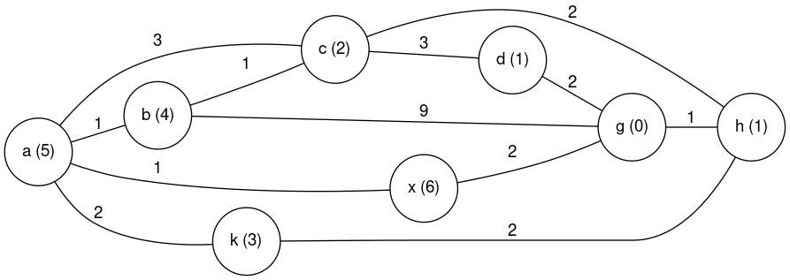
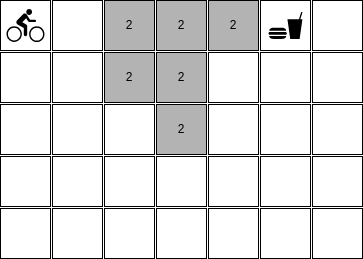
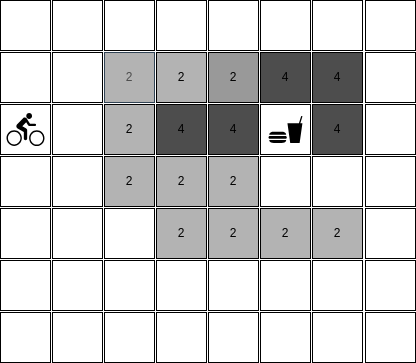
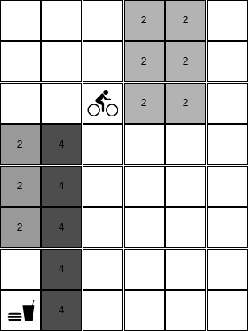
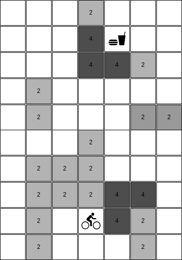
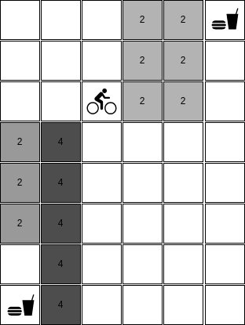

# Avaliação final 02/2023

## Orientações gerais

* Quaisquer hipóteses relevantes devem ser **explicitamente formuladas**. Faz parte da avaliação a **correta interpretação** das questões. A **clareza** e a **objetividade** das respostas serão consideradas na avaliação. 

* Esta avaliação é **individual**. Em hipótese alguma você poderá fazer uso de material de colegas.

* Durante esta avaliação você poderá fazer uso do seu material e de material existente na internet. 

## Questões

## Grafo (2.0 pontos)

Considere o grafo abaixo onde o número sobre as arestas é o custo de cada ação e o número em cada nodo é a heurística considerada até o
estado objetivo. Note que cada arco é bidirecional. Considere o estado **A** como inicial e o estado **G** como o estado objetivo. Em todos os algoritmos utilizados existe um único tipo de poda da árvore de busca que é: não pode-se abrir nenhum sucessor igual ao pai do nodo. 

* Qual é o caminho para a solução do problema que o algoritmo A* encontra.

* A heurística utilizada no problema é admissível? Explique.

* Qual é o caminho para a solução do problema que o algoritmo Ganancioso encontra. 

* Qual é o caminho para a solução do problema que o algoritmo de busca em largura encontra. 

* A solução encontrada pelo algoritmo de busca em largura é ótima? Justifique a sua resposta. 

Cada item desta questão vale 0.4 pontos. No entanto, cada item errado anula um item certo. Ou seja, se você não tiver certeza sobre a resposta, é melhor deixar o item em branco. 

## Bicicleta na montanha (4.0 pontos)

Neste exercício você deverá implementar um agente que é capaz de ir de um lugar até outro em um mapa. Este agente está andando de bicicleta e sabe executar as seguintes ações: 

* ir para baixo;
* ir para cima;
* ir para esquerda, e;
* ir para direita; 

Um exemplo possível de mapa que este agente pode receber é apresentado abaixo: 

Mapa 01: 

 

Neste estado inicial: 

* o ciclista está na posição [0,0],
* o fim do pedal mais o almoço estão esperando o ciclista na posição [0,5],
* o mapa tem 5 linhas e 7 colunas, e
* existem campos no mapa que estão pintados em cinza e que representam terrenos que tem uma altimetria mais alta. Ou seja, o ciclista terá que gastar mais energia para passar por estes campos. No caso dos campos marcados em cinza, o custo de cada ação é 2. 

Cada ação que o agente sabe executar tem custo 1. No entanto, quando uma ação é executada em um campo com altimetria maior então o custo dela passa a ser 2 ou 4 - dependendendo da altimetria. Se o campo tiver a cor cinza então o custo é 2, se o campo tiver a cor preta então o custo é 4 e se o campo tiver a cor branca então o custo é 1. 

Implemente uma solução que ajuda o ciclista a tomar a decisão com relação ao melhor plano - aquele plano que faz ele chegar no objetivo com o menor custo.

A solução implementada precisa ser capaz de tratar diversas configurações com diversas dimensões. Por exemplo:

Mapa 02:

 

Mapa 03: 

 

Mapa 04: 

 

Não existem testes pré-configurados. No entanto, recomenda-se fortemenete que você teste a sua implementação nos cenários descritos acima.

Nesta implementação você deve utilizar a biblioteca `aigyminsper`.

## Bike na montanha v2 (4.0 pontos)

Considere o mesmo problema da Bike. No entanto, agora existem mais de um ponto com lanche e o ciclista tem um limite de energia. Ou seja, ele precisa chegar no ponto de lanche com energia suficiente. O custo da solução precisa ser o menor possível, mas também precisa ser menor ou igual ao limite de energia.

Veja um exemplo de mapa abaixo:

O seu programa deverá retornar o caminho que o ciclista deve seguir para chegar no ponto de lanche com energia suficiente. Sempre deve retornar o caminho mais curto, ou seja, o lanche mais curto. Se não existir um caminho que atenda a restrição de energia então o programa deve retornar `Sem solução`.

Nesta implementação você também deverá usar a biblioteca `aigyminsper` e poderá usar como base a implementação da questão anterior. Mas, você deverá entregar dois arquivos distintos. 

## Entrega dos itens da avaliação

Toda a prova deve ser submetida no Github Classroom através deste link: [https://classroom.github.com/a/fSGT_Ia-](https://classroom.github.com/a/fSGT_Ia-).

Os arquivos que precisam ser submetidos são: 

* `Grafo.md`: onde você irá colocar a resposta para a questão do Grafo. 
* `requirements.txt`: arquivo com todas as bibliotecas necessárias para as soluções que você irá entregar. 
* `Bike.py`: arquivo com a solução para o problema da Bike.
* `Bike_v2.py`: arquivo com a solução para o problema da Bike na versão 2.

Não existe nenhum projeto de *template* e também não existem arquivos de testes. 

No caso das implementações, você deverá definir tudo: como os estados são representados, quais são os parâmetros do construtor da classe, quais são as ações e como elas afetam os estados, qual é o critério que retorna `true` para o método `is_goal()`, e assim em diante. 

O horário limite para entrega da prova é 09:45 do dia 13 de novembro de 2023. Para fins de avaliação será considerado último `commit` no repositório. 

