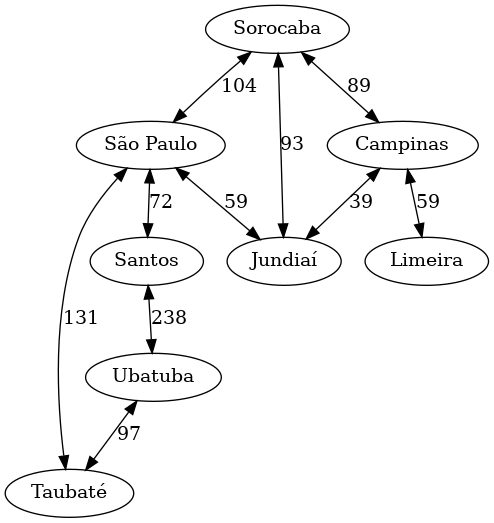
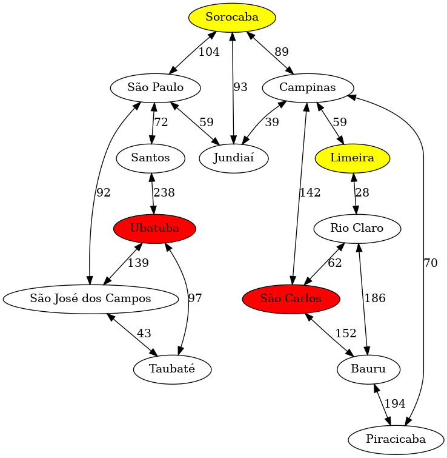

# Avaliação intermediária 02/2023

## Orientações gerais

* Quaisquer hipóteses relevantes devem ser **explicitamente formuladas**. Faz parte da avaliação a **correta interpretação** das questões. A **clareza** e a **objetividade** das respostas serão consideradas na avaliação. 

* Esta avaliação é **individual**. Em hipótese alguma você poderá fazer uso de material de colegas.

* Durante esta avaliação você poderá fazer uso do seu material e de material existente na internet. 

## Questões

### (4.0 pontos) Caminho entre cidades

Considere o mapa abaixo: 



O mapa é composto por 8 cidades: Campinas, Jundiaí, Limeira, Santos, São Paulo, Sorocaba, Taubaté e Ubatuba. As cidades são conectadas por estradas de mão dupla. No grafo acima as cidades são representadas por vértices e as estradas por arestas. O valor de cada aresta significa a distância entre as cidades. 

Ao implementar a sua solução, você deve adicionar em sucessores as cidades em ordem alfabética. Por exemplo, de Jundiaí você pode ir para Campinas, São Paulo e Sorocaba. Neste caso, você deve adicionar Campinas, São Paulo e Sorocaba nesta ordem.

A descrição dos estados, implementada pelo método `env()`, deve retornar apenas o nome da cidade. 

Implemente um programa que seja capaz de responder as perguntas listadas abaixo:

1. Qual é o caminho encontrado pelo algoritmo de busca em profundidade sem poda, com limite máximo de profundidade igual a 50, entre Jundiaí e Sorocaba?
1. Qual é o caminho encontrado pelo algoritmo de busca em profundidade com poda (`pruning='father-son'`), com limite máximo de profundidade igual a 50, entre Jundiaí e Sorocaba?
1. Qual é a resposta encontrada pelo algoritmo de busca em profundidade, com limite máximo de profundidade igual a 4, para sair de Limeira e chegar em Ubatuba? 
1. Qual é o menor caminho entre Campinas e Santos? Implemente uma solução que garante que o menor caminho será encontrado para todo e qualquer combinação de estado inicial e final.
1. Qual é a resposta para a pergunta anterior se não for permitido passar por São Paulo?

Nesta implementação você deve usar a biblioteca `aigyminsper`. Você deve implementar o agente e o método `main()` que faz a chamada para responder as perguntas acima. 

Você não será avaliado apenas pela resposta correta, mas também pela implementação do agente.


### (6.0 pontos) Definindo rotas de ônibus

Para este exercício, considere uma empresa de ônibus que precisa definir novas rotas de ônibus. Esta empresa tem um mapa que é a versão ampliada do mapa anterior: 



Neste mapa, algumas cidades estão marcadas com vermelho e outras com amarelo. As cidades marcadas com vermelho são cidades consideradas estratégicas pela empresa de ônibus - cidades que atualmente não são atendidas pela empresa mas que precisam ser atendidas em um futuro próximo. As cidades marcadas com amarelo são cidades que possuem terminais de carga. Sempre que uma rota de ônibus transportar além de pessoas, objetos de carga, ela deve passar por um terminal de carga.

Implemente uma solução usando a biblioteca `aigyminsper` que seja capaz de responder as perguntas listadas abaixo:

1. Qual é o menor caminho entre Sorocaba e Piracicaba que passa por um terminal de carga? E qual é o custo deste caminho?
1. Qual é o menor caminho entre Sorocaba e Piracicaba que passa por uma cidade estratégica? Qual é o custo deste caminho?
1. Qual é o menor caminho entre Sorocaba e Piracicaba sem considerar cidades estratégicas e terminais de carga? Qual é o custo deste caminho?
1. Qual deve ser a rota de ônibus entre Taubaté e Campinas que passa por um terminal de carga e por uma cidade estratégica? Qual é o custo desta rota? 
1. Qual deve ser a rota de ônibus entre Taubaté e Campinas que passa por uma cidade estratégica? Qual é o custo desta rota? 


Para cada rota você também deve calcular o custo da rota. Segundo a empresa, o custo da rota é dado por: 

```python
def custo(km):  
    return 0.5 * km
```  

Utilize esta equação na função `cost()` do agente. 

Você deve implementar o agente e o método `main()` que faz a chamada para responder as perguntas acima. Você não será avaliado apenas pela resposta correta, mas também pela implementação do agente.

## Entrega dos itens da avaliação

Toda a prova deve ser submetida no Github Classroom através deste link: [https://classroom.github.com/a/zhjam421](https://classroom.github.com/a/zhjam421).

Os arquivos que precisam ser submetidos são: 

* `requirements.txt`: arquivo com todas as bibliotecas necessárias para as soluções que você irá entregar. 
* `Mapa.py`: arquivo com a solução para o problema do Mapa.
* `Rotas.py`: arquivo com a solução para o problema das Rotas.

Não existe nenhum projeto de *template* e também não existem arquivos de testes. 

No caso das implementações, você deverá definir tudo: como os estados são representados, quais são os parâmetros do construtor da classe, quais são as ações e como elas afetam os estados, qual é o critério que retorna `true` para o método `is_goal()`, e assim em diante. 

O horário limite para entrega da prova é 09:30 do dia 25 de setembro de 2023. Para fins de avaliação será considerado último `push` no repositório. 

