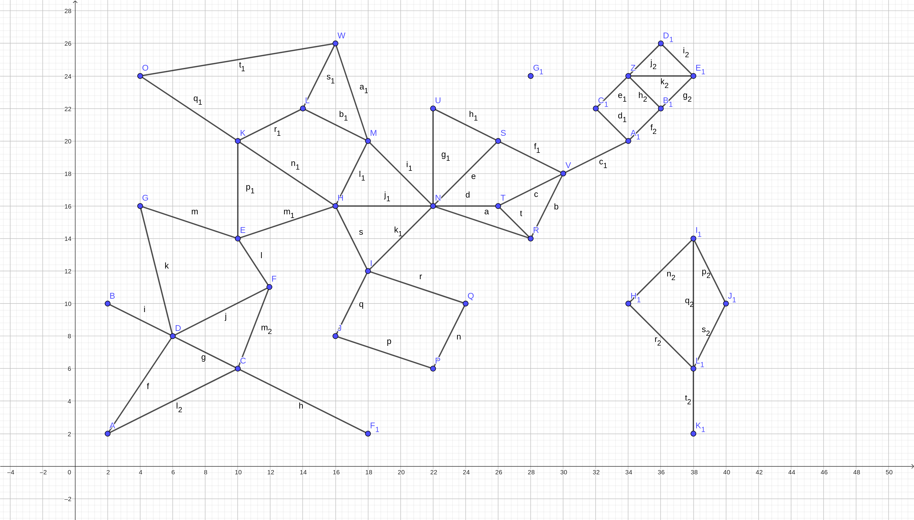
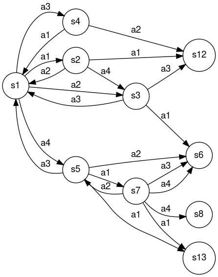

# Avaliação final 01/2023

## Orientações gerais

* Quaisquer hipóteses relevantes devem ser **explicitamente formuladas**. Faz parte da avaliação a **correta interpretação** das questões. A **clareza** e a **objetividade** das respostas serão consideradas na avaliação. 

* Esta avaliação é **individual**. Em hipótese alguma você poderá fazer uso de material de colegas.

* Durante esta avaliação você poderá fazer uso do seu material e de material existente na internet. 

## Questões

Abaixo são apresentas as questões desta avaliação. Todas as questões envolvem implementação. No entanto, elas são independentes. Você poderá, por exemplo, implementar a segunda questão primeiro e depois fazer a primeira questão. 

## Encontrar o menor caminho entre duas cidades (5.0 pontos)

Considere o mapa abaixo: 



Cada ponto (vértice do grafo) neste mapa é uma cidade. Cada aresta existente no mapa representa uma rodovia que liga duas cidades. 

A localização desta cidade é obtida através do eixo `x` e `y`. Por exemplo, a cidade `A` está localizada no ponto `2,2` enquanto que a cidade `F` está localizada no ponto `12,11`. 

As localizações das cidades estão armazenadas em um arquivo [cidades.txt](./data/cidades.txt) que respeita o seguinte formato: 

```
A,2,2
B,2,10
C,10,6
```

Onde a primeira coluna é o nome da cidade, a segunda coluna é a posição no eixo X e a terceira é a posição no eixo Y. 

As informações sobre as rodovias estão armazenadas em um arquivo [rodovias.txt](./data/rodovias.txt) que respeita o seguinte formato: 

```
A,D,8
D,C,5
C,F1,9
```

Neste caso, a primeira coluna é o nome de uma cidade que está conectada com a cidade na segunda coluna. A terceira coluna é a distância entre estes dois pontos. Por exemplo, na primeira linha temos uma conexão entre as cidades `A` e `D` com distância de 8 unidades. Esta conexão é bidirecional, ou seja, de `A` para `D` e de `D` para `A`. Em ambos os casos a distância é 8 unidades. 

Crie um programa em `python` que lê os dados dos dois arquivos: [cidades.txt](./data/cidades.txt) e [rodovias.txt](./data/rodovias.txt), e que solicita uma cidade de destino e uma cidade de origem:

```bash
Informe a cidade de origem: 
Informe a cidade de destino:
```

Retornando: 

```
A solucao encontrada foi: ...
O custo da solucao eh: ...
```

Para situações onde existe um caminho entre origem e destino. A solução sempre deve encontrar uma solução ótima. 

Para situações onde não existir um caminho entre origem e destino o sistema deverá imprimir: 

```
Nao achou solucao.
```

O arquivo principal desta solução deve-se chamar `Mapa.py` e deve ser possível a sua execução por um usuário final. 

## Problema de otimização (2.5 pontos)

Considere um problema de otimização de uma função $f(x) = x^{2} + 8x$. Utilize um dos algoritmos de subida da montanha para encontrar o mínimo global desta função no intervalo $[-10,4]$. Você deve:

* utilizar uma das implementações existentes no pacote `aigyminsper.search.CSPAlgorithms`. 
* definir a forma para representação do estado.
* definir o método para geração dos sucessores.

Além da implementação, você deve informar qual é o valor de $x$ que minimiza a função $f(x) = x^{2} + 8x$.   

## Problema de tomada de decisão (1.0 ponto)

Considere a árvore abaixo. 


Esta é árvore que um agente no estado $n0$ montou para tomar a decisão sobre qual movimento realizar (X, Q ou M) em um ambiente competitivo de soma zero. 

Esta árvore foi construída por uma implementação de algoritmo MinMax que vai até a profundidade 3 ou até o estado ser terminal. Neste caso, os estados terminais são $n5, n6, n7, n9, n10$. 

Nos estados que estão na última profundidade foi aplicado uma função de avaliação que resultou nos seguintes valores: 

|Nodo | Valor |
|:----|:-----:|
|n13|-0.5|
|n14|-0.8|
|n15|0.2|
|n16|1
|n17|1
|n18|0.5
|n19|0
|n20|0
|n21|1
|n22|0
|n23|0.2
|n24|-0.1

Para os nodos terminais, temos: 

|Nodo | Valor |
|:----|:-----:|
|n5| 0|
|n6| 0|
|n7| -1
|n9| 1
|n10| 1

**Qual a ação o agente irá executar?**

## Trajetória de um agente (1.5 pontos)

Considere a q-table abaixo: 

| Estado | a1 | a2 | a3 | a4|
|:-------|:--:|:--:|:--:|:--:|
|s1 |1.820497446483078097e-01|1.672403026363881162e-01|1.462863182180913768e-01|1.319596081271695587e-01
|s2 |6.575612431245246581e-02|4.886086895589866752e-02|5.729844336040951225e-02|1.236377010967146112e-01
|s3 |1.797700116558251238e-01|6.869404674779222564e-02|6.700650144505655714e-02|7.866948735306483753e-02
|s4 |4.804406621044567810e-02|5.681922181854820453e-02|5.161079122128384850e-02|6.260706462214110646e-02
|s5 |2.382695363299177360e-01|9.660681443381205491e-02|1.907980944253327357e-02|1.328624891343894998e-01
|s6 |0.000000000000000000e+00|0.000000000000000000e+00|0.000000000000000000e+00|0.000000000000000000e+00
|s7 |1.948433758205934951e-01|2.493041368770583868e-02|2.463861052341146871e-02|9.983255573445537490e-03
|s8 |0.000000000000000000e+00|0.000000000000000000e+00|0.000000000000000000e+00|0.000000000000000000e+00
|s9 |1.666272840890315465e-01|1.737777096033592261e-01|1.270244184420298850e-01|2.780991079997025550e-01
|s10|1.364267140353675467e-01|3.505100204919884277e-01|1.719287045179138940e-01|2.685975326567368593e-01
|s11|3.925612105912859584e-01|1.276615480466181674e-01|6.362321028893133668e-02|2.032619282882837941e-01
|s12|0.000000000000000000e+00|0.000000000000000000e+00|0.000000000000000000e+00|0.000000000000000000e+00
|s13|0.000000000000000000e+00|0.000000000000000000e+00|0.000000000000000000e+00|0.000000000000000000e+00
|s15|2.338732681482918463e-01|3.562267860404136899e-01|5.474288785122312095e-01|3.173993875616495375e-01
|s16|4.471816274853617768e-01|7.829629822180412813e-01|4.633488318321981048e-01|5.644139615087363504e-01
|s17|0.000000000000000000e+00|0.000000000000000000e+00|0.000000000000000000e+00|0.000000000000000000e+00

E o grafo com as transições entre os estados: 



Considere também que os estados $s6, s8, s12, s13, s17$ são terminais.

Dado que o agente está no estado $s1$, **descreva qual é a trajetória do agente (estados e ações) até chegar em um estado terminal**.

Explique qual é a lógica que justifica este funcionamento. 

## Entrega dos itens da avaliação

Toda a prova deve ser submetida no Github Classroom através deste link: [https://classroom.github.com/a/-yJ1imh4](https://classroom.github.com/a/-yJ1imh4).

Os arquivos que precisam ser submetidos são: 

* `README.md`: onde você irá colocar as respostas para as questões que não envolvem implementação ou os complementos das demais questões. 
* `requirements.txt`: arquivo com todas as bibliotecas necessárias para as soluções que você irá entregar. 
* `Mapa.py`: arquivo com a solução para o problema dos caminhos entre as cidades.
* `Otimizacao.py`: arquivo com a solução para o problema de otimização. 

Não existe nenhum projeto de *template* e também não existem arquivos de testes. 

No caso das implementações, você deverá definir tudo: como os estados são representados, quais são os parâmetros do construtor da classe, quais são as ações e como elas afetam os estados, qual é o critério que retorna `true` para o método `is_goal()`, e assim em diante. 

O horário limite para entrega da prova é 10:00 do dia 15 de maio de 2023. Para fins de avaliação será considerado último `commit` no repositório. 

