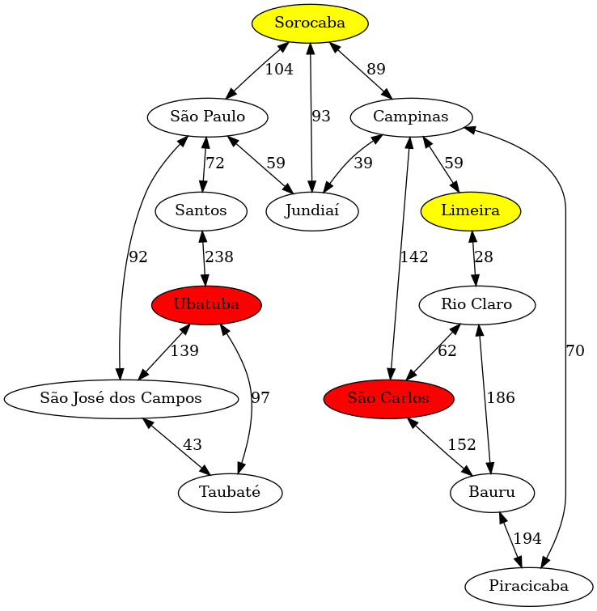

# Avaliação intermediária 01/2024

## Orientações gerais

* Quaisquer hipóteses relevantes devem ser **explicitamente formuladas**. Faz parte da avaliação a **correta interpretação** das questões. A **clareza** e a **objetividade** das respostas serão consideradas na avaliação. 

* Esta avaliação é **individual**. Em hipótese alguma você poderá fazer uso de material de colegas.

* Durante esta avaliação você poderá fazer uso do seu material. Não poderá fazer uso de material existente na Internet e também não poderá fazer uso do CoPilot. Quem tiver o CoPilot habilitado deverá desabilitá-lo durante a avaliação. 

## Questões

### 1. (2 pontos) $2k$ e $2k+1$

Considere um espaço de estados onde o estado inicial é o número 1 e cada estado $k$ gera dois estados sucessores, $2k$ e $2k+1$. Suponha que o estado objetivo seja o número 11.

1. (0.5 pontos) Liste a ordem em que os estados são visitados (retirados de abertos) em uma busca em largura.
1. (0.5 pontos) Liste a ordem em que os estados são visitados (retirados de abertos) em uma busca em profundidade com o limite 3.
1. (1 ponto) Liste a ordem em que os estados são visitados (retirados de abertos) em uma busca A* com a heurística $h(n) = 11 - n$. Neste caso os sucessores só são gerados se $n \leq 11$.

### 2. (6 pontos) Definindo rotas de ônibus

Para este exercício, considere uma empresa de ônibus que precisa definir novas rotas de ônibus. Esta empresa tem um mapa com cidades conectadas por estradas de mão dupla. No grafo abaixo as cidades são representadas por vértices e as estradas por arestas. O valor de cada aresta significa a distância entre as cidades.



Neste mapa, algumas cidades estão marcadas com vermelho e outras com amarelo. As cidades marcadas com vermelho são cidades consideradas estratégicas pela empresa de ônibus - cidades que atualmente não são atendidas pela empresa mas que precisam ser atendidas em um futuro próximo. As cidades marcadas com amarelo são cidades que possuem terminais de carga. Sempre que uma rota de ônibus transportar além de pessoas, objetos de carga, ela deve passar por um terminal de carga.

Estimando a complexidade do problema: 

1. Qual é a ramificação do problema? 
1. Qual é a profundidade máxima do problema?
1. Levando-se em consideração a ramificação informada e a profundidade máxima, qual é o tamanho do espaço de estados para o problema?
1. O que é importante representar no estado do problema? Descreve os atributos que a sua classe deve ter e o significado deles.

Implemente uma solução usando a biblioteca `aigyminsper` que seja capaz de responder as perguntas listadas abaixo:

1. Qual é o menor caminho entre São Paulo e Piracicaba que passa por um terminal de carga? E qual é o custo deste caminho?
1. Qual é o menor caminho entre Taubaté e Piracicaba que passa por uma cidade estratégica? Qual é o custo deste caminho?
1. Qual é o menor caminho entre Sorocaba e Piracicaba sem considerar cidades estratégicas e terminais de carga? Qual é o custo deste caminho?
1. Qual deve ser a rota de ônibus entre Taubaté e Campinas que passa por um terminal de carga e por uma cidade estratégica? Qual é o custo desta rota? 
1. Qual deve ser a rota de ônibus entre Taubaté e Campinas, sem considerar cidades estratégicas ou terminais de carga? Qual é o custo desta rota? 

Para cada rota você também deve calcular o custo da rota. Segundo a empresa, o custo da rota é dado por: 

```python
def custo(km):  
    return 0.5 * km
```  

Utilize esta equação na função `cost()` do agente. 

Você deve implementar o agente e o método `main()` que faz a chamada para responder as perguntas acima. Você não será avaliado apenas pela resposta correta, mas também pela implementação do agente.

Se você implementar uma solução que ignorar a existência de cidades estratégicas e terminais de carga, mas que é capaz de retornar a solução de menor custo então você terá 50% da nota. Para ter 100% da nota você precisa implementar uma solução que considera cidades estratégicas e terminais de carga.

Você pode usar o dicionário abaixo para implementar a sua solução:

```python
mapa = {
        'Taubaté':[(43,'São José dos Campos'),(97,'Ubatuba')],
        'São José dos Campos':[(43,'Taubaté'),(139,'Ubatuba'),(92,'São Paulo')],
        'Ubatuba':[(97,'Taubaté'),(139,'São José dos Campos'),(238,'Santos')],
        'Santos':[(238,'Ubatuba'),(72,'São Paulo')],
        'Sorocaba':[(104,'São Paulo'),(89,'Campinas'),(93,'Jundiaí')],
        'Jundiaí':[(59,'São Paulo'),(39,'Campinas'),(93,'Sorocaba')],
        'Campinas':[(89,'Sorocaba'),(39,'Jundiaí'),(142,'São Carlos'),(70,'Piracicaba'),(59,'Limeira')],
        'São Carlos':[(142,'Campinas'),(62,'Rio Claro'),(152,'Bauru')],
        'Limeira':[(59,'Campinas'),(28,'Rio Claro')],
        'Rio Claro':[(62,'São Carlos'),(28,'Limeira'),(186,'Bauru')],
        'Bauru':[(152,'São Carlos'),(186,'Rio Claro'),(194,'Piracicaba')],
        'Piracicaba':[(70,'Campinas'),(194,'Bauru')]
        }
```

**Importante**: Se você for utilizar o dicionário acima então revise o mesmo. Ele poderá estar incompleto!

O caminho precisa ter o seguinte formato:

```bash
sair de Taubaté ; ir para São José dos Campos ; ir para São Paulo ; ir para Jundiaí ; ir para Campinas ; ir para Piracicaba ; ir para Bauru
497
```
Na primeira linha o plano e na segunda linha o custo. O plano precisa necessariamente começar com a string "sair de" e a cada nova cidade do plano deve ser concatenada a string "ir para".

### 3. (2 pontos) Distância entre cidades

Considere o problema de encontrar o menor caminho entre duas cidades visto em sala de aula. Suponha que a distância entre as cidades é dada pela emissão de CO2 em toneladas. Considere que todos os veículos que circulam entre as cidades emitem 0.1 toneladas de CO2 por quilômetro rodado. Suponha que a única informação que você tem além do mapa e a distância entre as cidades em CO2 é a latitude e longitude das cidades. Que heurística você usaria para resolver o problema? Esta heurística precisa ser admissível. Justifique a sua resposta. Ao definir a heurística faça uso de uma equação para deixar a resposta mais clara e objetiva. 

## Entrega dos itens da avaliação

Toda a prova deve ser submetida no Github Classroom através deste link: []().

Os arquivos que precisam ser submetidos são: 

* `requirements.txt`: arquivo com todas as bibliotecas necessárias para as soluções que você irá entregar. 
* `Mapa.py`: arquivo com a solução para o problema do Mapa.
* `README.md`: no arquivo de README.md você deve colocar as respostas para as perguntas da questão 1, do início da questão 2 e da questão 3. 

Não existe nenhum projeto de *template* e também não existem arquivos de testes. 

No caso das implementações, você deverá definir tudo: como os estados são representados, quais são os parâmetros do construtor da classe, quais são as ações e como elas afetam os estados, qual é o critério que retorna `true` para o método `is_goal()`, e assim em diante. 

**Esta prova tem duração de 2 (duas) horas**.

O horário limite para entrega da prova é 15:40 do dia 22 de setembro de 2023. Para fins de avaliação será considerado último `push` no repositório. 
