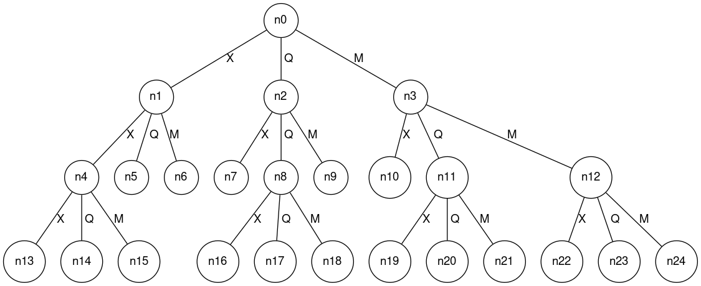

# Avaliação final 01/2024

## Orientações gerais

* Quaisquer hipóteses relevantes devem ser **explicitamente formuladas**. Faz parte da avaliação a **correta interpretação** das questões. A **clareza** e a **objetividade** das respostas serão consideradas na avaliação. 

* Esta avaliação é **individual**. Em hipótese alguma você poderá fazer uso de material de colegas.

* Durante esta avaliação você poderá fazer uso do seu material e poderá buscar por informações na Internet. Você não poderá fazer uso de qualquer *Large Language Model* para geração de código, nem ChatGPT, nem CoPilot. **Quem tiver o CoPilot habilitado deverá desabilitá-lo durante a avaliação**.

* Para a execução desta prova você deverá acessar o Github Classroom neste [https://classroom.github.com/a/dlXUTKW3](https://classroom.github.com/a/dlXUTKW3). A submissão da sua prova será via este link. Neste link você irá encontrar um projeto que já possui alguns arquivos iniciais. Você deverá considerar estes arquivos para o desenvolvimento das suas soluções. 

## Questões

Considere o ambiente implementado na biblioteca [https://github.com/damat-le/gym-simplegrid](https://github.com/damat-le/gym-simplegrid). Este ambiente fornece um grid 2D onde o agente pode se movimentar para cima, para baixo, para a esquerda e para a direita. O ambiente possui um estado inicial e um estado objetivo, além de obstáculos. O objetivo do agente é encontrar o menor caminho entre o estado inicial e o estado objetivo.

Este ambiente permite configurar mapas diversos e selecionar aleatóriamente ou de forma pré-determinada a posição inicial e final do agente. Este ambiente implementa uma função de reward considerando a seguinte regra dado uma posição $(x, y)$ do agente:

```python
def get_reward(self, x: int, y: int) -> float:
    """
    Get the reward of a given cell.
    """
    if not self.is_in_bounds(x, y):
        # if the agent tries to exit the grid, it receives a negative reward
        return -1.0
    elif not self.is_free(x, y):
        # if the agent tries to walk over a wall, it receives a negative reward
        return -1.0
    elif (x, y) == self.goal_xy:
        # if the agent reaches the goal, it receives a positive reward
        return 1.0
    else:
        # otherwise, it receives no reward
        return 0.0
```

Nesta questão você terá que implementar duas versões de um agente que encontra o menor caminho entre o estado inicial e o estado objetivo. A primeira versão será utilizando algoritmos de busca (informados ou não informados) e a segunda versão será utilizando aprendizado por reforço.

### 1. Encontrando o menor caminho com algoritmos de busca (3 pontos)

No projeto você irá encontrar o arquivo `ambiente.py`, que tem o seguinte código: 

```python
import gymnasium as gym
import gym_simplegrid

env = gym.make('SimpleGrid-8x8-v0', render_mode='human')
obs, info = env.reset()
done = env.unwrapped.done

count_actions = 0
while not done and count_actions < 100:
    action = env.action_space.sample()
    obs, reward, done, _, info = env.step(action)
    count_actions += 1
    
env.close()
```

Neste caso, temos um agente que atua de forma aleatória no ambiente. Sugiro executar algumas vezes este arquivo para entender o funcionamento do ambiente. 

No mesmo projeto você irá encontrar os arquivos `ambiente_busca_estatico.py` e `ambiente_busca_dinamico.py`. Estes arquivos são versões modificadas do arquivo `ambiente.py` considerando o uso de algoritmos de busca. O estático fornece sempre o mesmo mapa, estado inicial e final. Enquanto que o dinâmico fornecerá mapas, estados iniciais e finais diferentes a cada execução.

Ambos os arquivos esperam por um arquivo `my_agent.py` que deve conter a implementação do agente. Além da classe do agente que implementa a interface `from aigyminsper.search.Graph import State`, este arquivo também possui as seguintes funções: 

```python
def get_actions(map, position, goal):
    #
    # TODO Esta função deve retornar uma lista de ações que o agente deve executar
    # Assim conseguimos executar o agente no ambiente usando a biblioteca
    # gym_simplegrid
    #
    # Se nao existir solucao, a funcao deve retornar None
    #
    return None

def parser_actions(str_actions):
    if str_actions != None:
        actions = str_actions.split(';')
        actions = list(map(int, actions[1:]))
        return actions
    return None
```

Você deverá implementar o arquivo `my_agent.py` usando o algoritmo de busca que você considerar mais adequado, usando a representação do estado que você considerar mais adequada. Mas você deve respeitar o código utilizado para as ações. Além de sempre gerar 4 sucessores para cada estado, não importanto se existe ou não obstáculo ao redor do agente. 

Para verificar se a soluções está correta, você pode testar a solução da seguinte forma: 

* execute o arquivo de teste `test_my_agent.py`;
* execute o arquivo `ambiente_busca_estatico.py`, neste arquivo o ambiente sempre terá a mesma configuração, o mesmo estado de início e o mesmo estado de fim. Ou seja, é mais fácil visualizar se a sua implementação tem algum problema ou não;
* execute o arquivo `ambiente_busca_dinamico.py`, neste arquivo o ambiente terá configurações diferentes a cada execução. 

Ter passado em todos os testes em `text_my_agent.py` não garante que a sua implementação esteja 100% correta. Você deve testar a sua implementação nos arquivos `ambiente_busca_estatico.py` e `ambiente_busca_dinamico.py`.

### 2. Encontrando o caminho com aprendizado por reforço (3 pontos)

Agora é a vez de utilizar reinforcement learning para encontrar o caminho entre o estado inicial e o estado objetivo. Ou seja, você vai treinar um agente que seja capaz de aprender a melhor política para navegar neste ambiente.

No mesmo projeto você irá encontrar os arquivos `TreinandoAgente.py`, `QLearning.py` e `analise_dados_treinamento.ipynb`. Use este arquivo para responder as perguntas abaixo. 

1. Qual foi a política que o agente aprendeu a executar? Treine o agente para responder a pergunta. Execute várias vezes o agente depois de treinado. Analise os gráficos gerados pelo arquivo `analise_dados_treinamento.ipynb`. Justifique a sua resposta. 

2. O que acontece se alterarmos os hiperparâmetros para $\alpha = 0.1, \gamma = 0.99, \epsilon = 0.8, \epsilon_{min} = 0.05, \epsilon_{dec} = 1, episodes = 1000$? Qual foi o comportamento do agente durante o treinamento? Depois de treinado o agente consegue alcançar o objetivo? Explique o que aconteceu. 

3. O que acontece se alterarmos os hiperparâmetros para $\alpha = 0, \gamma = 0.99, \epsilon = 0.8, \epsilon_{min} = 0.05, \epsilon_{dec} = 1, episodes = 1000$? Justifique a sua resposta. 

Os arquivos `TreinandoAgente.py` e `QLearning.py` estão configurados de tal maneira para sempre gerar um mapa com o mesmo estado final. O único dado que é alterado a cada simulação é a posição inicial do agente. 

No arquivo `TreinandoAgente.py` podemos ver esta consiguração nas linhas 19, 20 e 21: 

```python
(x_goal, y_goal) = (7,4)
g_loc = env.to_s(x_goal, y_goal)
state, info = env.reset(options={'goal_loc':g_loc})
#state, infor = env.reset()
```

E no arquivo `QLearning.py` podemos ver esta configuração nas linhas 32, 33 e 34: 

```python
(x_goal, y_goal) = (7,4)
g_loc = self.env.to_s(x_goal, y_goal)
(state, _) = self.env.reset(options={'goal_loc':g_loc})
#(state, _) = self.env.reset()
```

4. Se deixarmos o objetivo em uma posição diferente a cada simulação, o agente consegue alcançar o objetivo? Quais seriam os hiperparâmetros necessários? Justifique a sua resposta. Dica: dependendo dos hipeparâmetros escolhidos esta execução pode demorar algum tempo. Se bem justificada a sua resposta, talvez não seja necessário executar o código.

Dica: você pode comentar as linhas 19, 20 e 21 do arquivo `TreinandoAgente.py` e as linhas 32, 33 e 34 do arquivo `QLearning.py` para testar esta hipótese. Não esqueça de descomentar as linhas 22 do arquivo `TreinandoAgente.py` e a linha 35 do arquivo `QLearning.py`. Você pode usar os gráficos gerados no arquivo `analise_dados_treinamento.ipynb` para justificar a sua resposta.


### 3. Problema de otimização (2 pontos)

Considere um problema de otimização de uma função:

$f(x) = (x + 2)^{2} - 16 \times \exp(-(x-2)^{2})$

que pode ser escrita em python da seguinte forma: 

```python
import numpy as np

def f_x(x):
    return np.power(x + 2, 2) - 16 * np.exp(-np.power((x - 2), 2))
```

Com o seguinte intervalo para a variável $x$: $[-10,+10]$.

Você deve:

* utilizar uma das implementações existentes no pacote `aigyminsper.search.*`. 
* definir a forma para representação do estado.
* definir o método para geração dos sucessores. Dica: você pode gerar um sucessor que incrementa o valor de $x$ e outro que decrementa o valor de $x$. Além disso, você pode usar um passo de 0.1 para incrementar ou decrementar o valor de $x$.
* não sabemos qual é o valor mínimo que esta função pode ter. 

Além da implementação, entregue via o arquivo `Otimizacao.py`, você deve informar **qual é o valor de $x$ que minimiza o valor de retorno da função acima**. Explique a sua implementação. 

### 4. Problema de tomada de decisão (1 ponto)

Considere a árvore abaixo. 



Esta é árvore que um agente no estado $n0$ montou para tomar a decisão sobre qual movimento realizar (X, Q ou M) em um ambiente competitivo de soma zero. 

Esta árvore foi construída por uma implementação de algoritmo MinMax que vai até a profundidade 3 ou até o estado ser terminal. Neste caso, os estados terminais são $n5, n6, n7, n9, n10$. 

Nos estados que estão na última profundidade foi aplicado uma função de avaliação que resultou nos seguintes valores: 

|Nodo | Valor |
|:----|:-----:|
|n13|-0.5|
|n14|-0.8|
|n15|0.2|
|n16|1
|n17|1
|n18|0.5
|n19|0
|n20|0
|n21|1
|n22|0
|n23|0.2
|n24|-0.1

Para os nodos terminais, temos: 

|Nodo | Valor |
|:----|:-----:|
|n5| 0|
|n6| 0|
|n7| -1
|n9| 1
|n10| 1

**Qual a ação o agente irá executar?**

### 5. Analisando ambientes (1 ponto)

Ao longo do semestre fizemos algumas implementações, entre elas: busca de menor caminho entre duas cidades, um agente jogador de jogo da velha e um agente que é capaz de andar em um lago congelado. 

Considerando cada um destes ambientes, responda se os mesmos são determinísticos ou estocásticos, single ou multi-agentes, e diga qual foi o algoritmo utilizado para implementar a solução. 

## Entrega

Ao final da prova, você deverá submeter o seu projeto no Github Classroom. Este projeto deve ter todos os arquivos originais mais os arquivos que você implementou.

Existe um arquivo especial, que é o `respostas.md`. Neste arquivo você deve responder as questões 2, 3, 4 e 5. Este arquivo já possui um formato pré-definido. Você deve respeitar este formado! 
