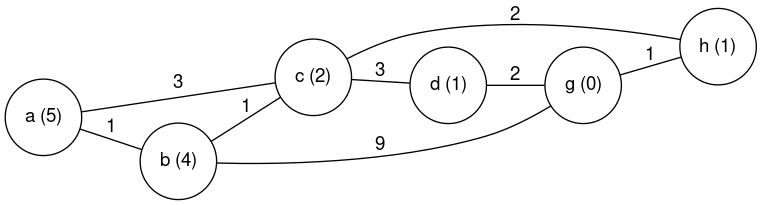
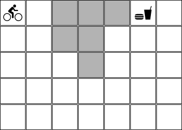
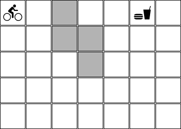
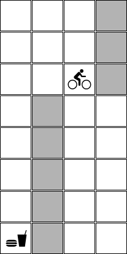
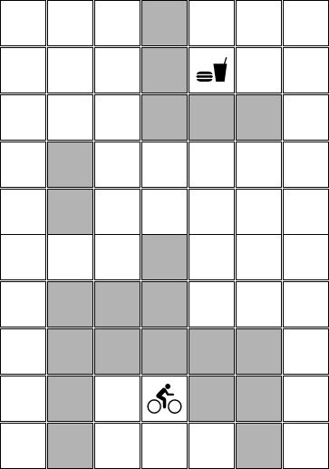

# Avaliação intermediária 01/2023

## Orientações gerais

* Quaisquer hipóteses relevantes devem ser **explicitamente formuladas**. Faz parte da avaliação a **correta interpretação** das questões. A **clareza** e a **objetividade** das respostas serão consideradas na avaliação. 

* Esta avaliação é **individual**. Em hipótese alguma você poderá fazer uso de material de colegas.

* Durante esta avaliação você poderá fazer uso do seu material e de material existente na internet. 

## Questões

## Web crawler 

O aplicativo `wget` é um web crawler disponível em sistemas operacionais do tipo *linux*. Com este aplicativo é possível informar uma `url` que será a base do *crawler*. A partir da `url` informada, o `wget` copia o conteúdo da página, identifica os links que estão nesta página, acessa o conteúdo destes links e copia o contéudo destas páginas de forma recursiva até encontrar um critério de parada. O critério de parada no caso do `wget` é a profundidade informada ao executar o comando.

Um código possível para o `wget` é apresentado abaixo: 

```python
def wget(url, profundidade):
    if profundidade > 0:
        armazena_conteudo(url)
        for nova_pagina in identifica_links(url):
            wget(nova_pagina, profundidade-1)
```

onde: 

* `armazena_conteudo(url)` é uma função que copia o contéudo da página para a máquina local, onde o `wget` está sendo executado. 
* `identifica_links(url)` é uma função que identifica todos os links na página - todas as tags `href`. 


Digamos que você precisa fazer o crawler de diversos conteúdos a partir de algumas páginas. Mas antes de fazer isto, você terá que fazer uma estimativa do tamanho de espaço necessário para armazenar todo o conteúdo. 

Os tópicos que você terá que armazenar são: 

* esportes: neste caso, você irá partir de uma única `url` e você sabe que todos os documentos que você irá baixar que estão relacionados com esta `url` tem **10 links** no seu conteúdo. Você também sabe que a profundidade configurada no `wget` para esportes será de **5**. E que cada documento documento tem o tamanho de 500 KBytes. Depois de executado o `wget` para esportes, quantos documentos (arquivos diferentes) serão armazenados no seu computador? Qual é o espaço que eles irão ocupar em GB? 

* cotidiano: neste caso, você irá partir de uma única `url` e você sabe que todos os documentos que você irá baixar que estão relacionados com esta `url` tem **3 links** no seu conteúdo. Você também sabe que a profundidade configurada no `wget` para o tema cotidiano será de **8**. E que cada documento documento tem o tamanho de 800 KBytes. Depois de executado o `wget` para cotidiano, quantos documentos (arquivos diferentes) serão armazenados no seu computador? Qual é o espaço que eles irão ocupar em GB? 

* Qual é a quantidade total de arquivos armazenados no seu computador? Qual é o espaço total que eles irão ocupar em MB? Justifique a sua resposta. 


## Grafo

Considere o grafo abaixo onde o número sobre as arestas é o custo de cada ação e o número em cada nodo é a heurística considerada até o
estado objetivo. Note que cada arco é bidirecional. Considere o estado **A** como inicial e o estado **G** como o estado objetivo. Em todos os algoritmos utilizados existe um único tipo de poda da árvore de busca que é: não pode-se abrir nenhum sucessor igual ao pai do nodo. 



* Qual é o caminho para a solução do problema que o algoritmo A* encontra.

* A heurística utilizada no problema é admissível? Explique.

* Qual é o caminho para a solução do problema que o algoritmo Ganancioso encontra. 

* Qual é o caminho para a solução do problema que o algoritmo de busca em largura encontra. 

* A solução encontrada pelo algoritmo de busca em largura é ótima? Justifique a sua resposta. 

## Bicicleta na lama

Neste exercício você deverá implementar um agente que é capaz de ir de um lugar até outro em um mapa. Este agente está andando de bicicleta e sabe executar as seguintes ações: 

* ir para baixo;
* ir para cima;
* ir para esquerda, e;
* ir para direita; 

Um exemplo possível de mapa que este agente pode receber é apresentado abaixo: 

Mapa 01: 

 

Neste estado inicial: 

* o ciclista está na posição [0,0],
* o fim do pedal mais o almoço estão esperando o ciclista na posição [0,5],
* o mapa tem 5 linhas e 7 colunas, e
* existem campos no mapa que estão pintados em cinza e que representam campos com muita lama. 

Cada ação que o agente sabe executar tem custo 1. No entanto, quando uma ação é executada em um campo com lama então o custo dela passa a ser 4. 

Implemente uma solução que ajuda o ciclista a tomar a decisão com relação ao melhor plano - aquele plano que faz ele chegar no objetivo com o menor custo.

A solução implementada precisa ser capaz de tratar diversas configurações com diversas dimensões. Por exemplo:

Mapa 02:

 

Mapa 03: 

 

Mapa 04: 

 

Não existem testes pré-configurados. No entanto, recomenda-se fortemenete que você teste a sua implementação nos cenários descritos acima.

Nesta implementação você deve utilizar a biblioteca `aigyminsper`.

