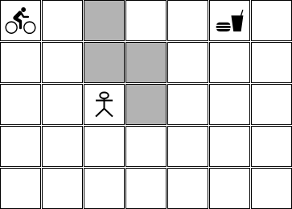

# Planejando rotas para um entregador

Este projeto terá várias entregas. O escopo da primeira entrega é a implementação das funcionalidades mais básicas do sistema de entrega de encomendas.

## Descrição do problema

Neste projeto você deverá implementar um agente que é capaz de ir de um lugar até outro em um mapa, buscar uma encomenda e entregá-la ao seu destinatário. Este agente está andando de bicicleta ou moto e sabe executar as seguintes ações: 

* ir para frente: ao executar esta ação o agente avança uma casa na direção que ele está olhando;
* virar para a esquerda: ao executar esta ação o agente muda a direção que ele está olhando para a esquerda e não avança nenhuma casa;
* virar para a direita: ao executar esta ação o agente muda a direção que ele está olhando para a direita e não avança nenhuma casa;
* pegar a encomenda: ao executar esta ação o agente pega a encomenda que está esperando por ele na casa onde ele está;
* entregar a encomenda: ao executar esta ação o agente entrega a encomenda que ele está carregando na casa onde ele está.

Um exemplo possível de mapa que este agente pode receber é apresentado abaixo: 

Mapa 01: 

 

Neste estado inicial: 

* o entregador está na posição [0,0],
* o item que deve ser entregue está na posição [0,5],
* o destinatário está na posição [4,5],
* o mapa tem 5 linhas e 7 colunas, e
* existem campos no mapa que estão pintados em cinza e que representam obstáculos. 

Cada ação que o agente sabe executar tem custo 1.  

Implemente uma solução que ajuda o entregador a tomar a decisão com relação ao melhor plano - aquele plano que faz ele chegar no objetivo com o menor custo.

A solução implementada precisa ser capaz de tratar diversas configurações com diversas dimensões. Por exemplo:

Mapa 02:

 

Mapa 03: 

 

Mapa 04: 

 

Não existem testes pré-configurados. No entanto, recomenda-se fortemente que você teste a sua implementação nos cenários descritos acima.

A configuração dos mapas não pode ser feita de forma fixa no código. A configuração dos mapas deve ser feita em arquivos de configuração.

Nesta implementação você deve utilizar a biblioteca `aigyminsper`.

## Entrega do projeto

- O projeto como um todo deverá ser feito por equipes com até 3 integrantes. 
- O prazo máximo para entrega é 20/03/2023 (quarta-feira) até às 23:30 horas.
- A entrega deverá ser feita via Github Classroom. O link para a entrega é [https://classroom.github.com/a/D8WBu3wF](https://classroom.github.com/a/D8WBu3wF).
- Cada equipe deverá entregar todos os arquivos python para o funcionamento da solução, uma arquivo README.md que explica como executar, todos os arquivos de configuração dos mapas e um arquivo de `requirements.txt` com todos os pacotes necessários para a execução do projeto. 