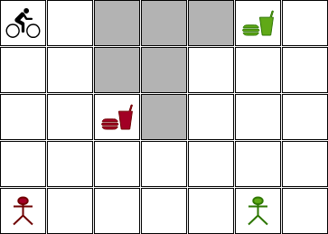

# Sistema de entrega de encomendas que considera mais de uma entrega

Nesta versão deste projeto a equipe deverá considerar mais de um entrega no mapa. Um exemplo é apresentado na figura abaixo: 

 

Neste caso, o cliente "vermelho" solicitou a comida "vermelha" e o cliente "verde" solicitou a comida "verde". Você deve considerar esta situação como sendo o mesmo instante de tempo, ou seja, o cliente "vermelho" e o cliente "verde" solicitaram a comida ao mesmo tempo. Para este caso, o seu sistema deve calcular o custo para atender a ambos os clientes e atender o cliente com menor custo primeiro. 

Para o mapa acima, a solução apresentada pelo seu módulo deve ser a seguinte:

```
Custo para atender o cliente vermelho: 14
Custo para atender o cliente verde: 24
O cliente vermelho será atendido.
```

A sua equipe deve criar vários cenários de testes para validar a implementação. Deve também considerar uma quantidade de entregas maior que 2. 

Quando você tiver isto pronto, por favor, chame o professor da disciplina para validar e fazer o:  

:new: check-point número 2. 

**Importante**: até este momento você poderá mudar de equipe. No entanto, as equipes continuaram com no máximo 3 integrantes. Para esta entrega será liberado um novo GitHub Classroom. 

