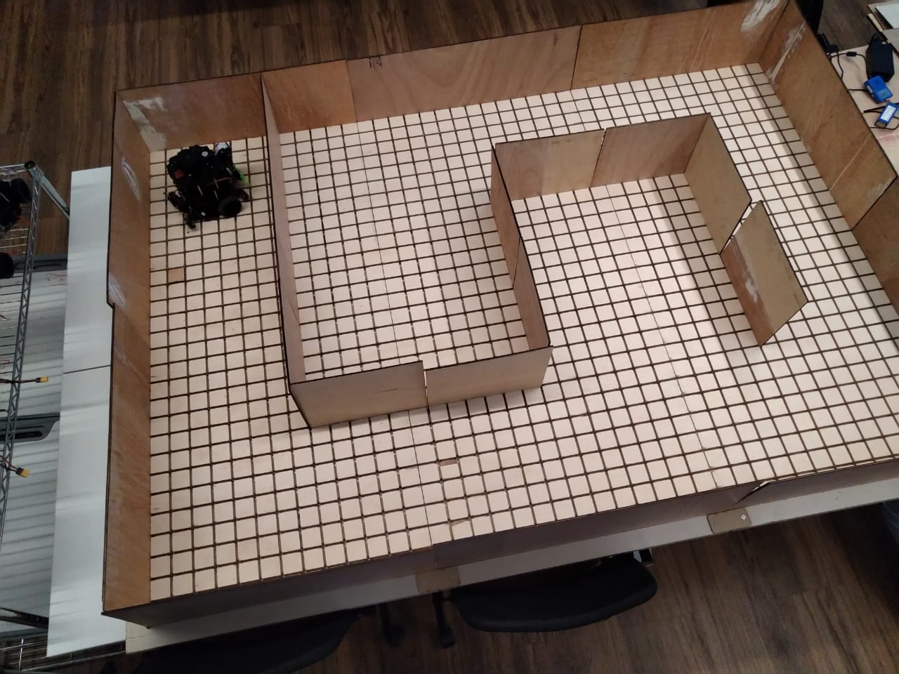
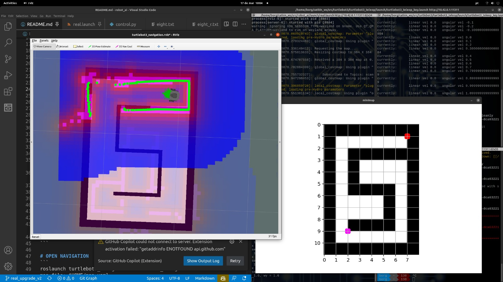
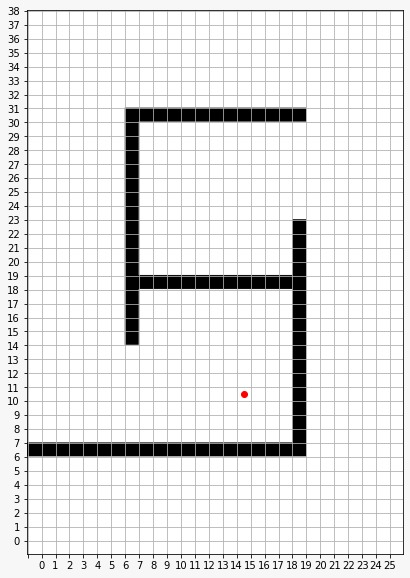

# Navegação de robôs

## Introdução

Muitos de vocês já devem ter visto o labirinto para robôs em sala de aula: 

<center>

</center>

O objetivo deste projeto é implementar um planejador de ações para o robô que está na imagem acima. Este robô deverá sair de uma posição, chegar em uma posição intermediária, realizar um conjunto de ações e depois chegar em uma posição final. As posições iniciais, intermediárias, finais, e o formato do labirinto são variáveis.

Este robô tem um conjunto de **sensores** e **atuadores** que permitem a navegação do mesmo pelo labirinto. Por exemplo, no que diz respeito aos sensores, este robô é capaz de identificar obstáculos, como visto na figura abaixo: 

<center>

</center>

Todo o controle dos sensores e atuadores do robô é feito utilizando um conjunto de bibliotecas e ferrramentas do projeto [ROS](http://wiki.ros.org/). Para este projeto, o professor Diego desenvolveu um módulo que abstrai toda a parte de sensores e atuadores. 

Este módulo recebe apenas uma lista de coordenadas e ações. A partir desta lista de coordenadas e ações o robô físico consegue se mover pelo labirinto. Considere a seguinte abstração para o labirinto acima: 

<center>

</center>

Onde o ponto vermelho é a posição final. Digamos que o robô esteja na posição `3,3`, um exemplo de plano é apresentado abaixo: 

**Plano completo**:
```
3,3
4,3
5,3
6,3
7,3

23,3
23,4
23,5
23,6
23,7

23,27
22,27
21,27
20,27

10,27
11,27
12,27
13,27
14,27
15,27

23,27
23,28
23,29
23,30
23,31

23,35
22,35
21,35

3,35
3,34
3,33
3,32
3,31

3,11
4,11
5,11
6,11
7,11
8,11

13,11
14,11
15,11
yey
```

Este plano pode ser simplificado para um **plano resumido**: 

```
3,3
23,3
23,27
10,27
23,27
23,35
3,35
3,11
15,11
yey
```

que o robô também irá entender o que fazer. 

Cada uma das linhas são coordenadas do mapa. A única ação que não é coordenada é o `yey`- que é uma ação de comemoração. Quando você pedir para o robô fazer um `yey` ele irá gerar movimentos que parecem uma comemoração. 

A sua tarefa será desenvolver um módulo que a partir de uma configuração inicial envolvendo: 

* um mapa específico;
* uma posição inicial;
* posições onde o robô deve chegar e comemorar, e;
* uma posição final.

Deve criar uma sequência de ações que serão enviadas para o robô executar. Esta sequência de ações deve ser uma solução ótima. 

## Agenda e método de trabalho

O cronograma do projeto tem os seguintes marcos: 

* **03-Maio**: divulgação do enunciado. Cada equipe terá acesso ao enunciado e poderá desenvolver a sua solução com base no exemplo de labirinto descrito aqui. 

* **08-Maio**: as equipes deverão testar as suas soluções submentendo o conjunto de ações para um robô disponível em sala de aula. O labirinto disponível em sala de aula será o mesmo que está descrito neste enunciado.

* **10-Maio**: um novo labirinto estará disponível em sala de aula. O robô pode iniciar de qualquer ponto, chegar em qualquer ponto e comemorar quantas vezes for necessário. A solução final deverá ser capaz de criar planos para todos os cenários possíveis. 

O deadline para entrega de todos os artefatos é dia **10 de maio**. No entanto, a equipe deverá fazer demonstrações do funcionamento do projeto ao longo das aulas dos dias 08 e 10 de maio.

## Entregáveis e rubrica de avaliação

Todas as entregas devem ser feitas via Github classroom. O link para o Github classroom deste projeto é este: [xxxx](). Todo o código da solução deve ser adicionado ao repositório, além de um arquivo README.md, que descreve como deve ser utilizada a solução, e um arquivo requirements.txt, que enumera os pacotes necessários para a execução da implementação. 

**Grupo de requisitos 1**: 

| Descrição                                                            | Conceito |
|:---------------------------------------------------------------------|:--------:|
| A equipe desenvolveu uma solução onde não é possível fazer nenhum configuração. A solução funciona apenas para um caso específico.       |    I     |
| A equipe desenvolveu uma solução onde é fácil configurar o cenário dado um labirinto qualquer. Ou seja, a posição inicial do robô, a posição final do robô e os locais onde as comemorações devem acontecer são informadas via arquivo de configuração ou via parâmetros do programa. Mas não é possível configurar facilmente o formato do labirinto. |  C    |
| A equipe desenvolveu uma solução onde é fácil configurar o cenário e também é fácil configurar um labirinto qualquer. Ou seja, a posição inicial do robô, a posição final do robô, os locais onde as comemorações devem acontecer e o **mapa do labirinto** são informados via arquivo de configuração ou via parâmetros do programa usando uma notação fácil de ser compreendida e editada.                                               |   A   | 


**Grupo de requisitos 2**: 

| Descrição                                                            | Conceito |
|:---------------------------------------------------------------------|:--------:|
| A implementação da equipe não retorna soluções ótimas                |     I    |
| A implementação da equipe sempre retorna uma solução ótima, se uma solução existir, independente do cenário mas sempre considerando o labirinto deste enunciado.                                             |     C    |
| A implementação da equipe sempre retorna uma solução ótima, se uma solução existir, **independente do cenário e do labirinto**.               |     A    |


**Grupo de requisitos 3**: 

| Descrição                                                            | Conceito |
|:---------------------------------------------------------------------|:--------:|
| O módulo entrega apenas o plano no formato completo                  |    C     |
| O módulo entrega o plano no formato sumarizado                       |    A     | 

**Grupo de requisitos 4**: 

| Descrição                                                            | Conceito |
|:---------------------------------------------------------------------|:--------:|
| Falta algum código para a solução funcionar ou o arquivo de README.md ou o arquivo de requirements.txt | I |
| O arquivo de README.md não está bem escrito. Ou seja, através do arquivo README.md não é possível saber como executar a implementação. | D |
| Os artefatos estão completos no repositório. | A | 

### Cálculo do conceito final

O cálculo do conceito final é composto por 4 grupos de requisitos. As regras para cálculo do conceito final são: 

* Se a equipe obter conceito **I** em algum grupo de requisito então a nota final será **I**.

Para as demais situações tem-se: 

| Grupo 1 | Grupo 2 | Grupo 3 | Grupo 4 | Conceito Final |
|:-------:|:-------:|:-------:|:-------:|:--------------:|
|    C    |    C    |    -    |    D    |       D        |         
|    C    |    C    |    -    |    A    |       C        |
|    A    |    C    |    -    |    D    |       D        |
|    A    |    C    |    -    |    A    |       C        |
|    A    |    A    |    C    |    D    |       B        |
|    A    |    A    |    C    |    A    |       A        |
|    A    |    A    |    A    |    A    |       A+       |

## Equipes

Para este projeto devem ser consideradas as seguintes equipes: 


| Equipe | Estudantes |
|:-------|:-----------|
|1	|JOÃO LUCAS DE MORAES BARROS CADORNIGA <br> LIVIA TANAKA <br> ALAN MATHEUS ALVES BARBOSA
|2	|TOMAS RODRIGUES ALESSI <br> ALEXANDRE MAGNO MACIEL DOS SANTOS <br> JULIA KARINE PERES
|3	|MATHEUS AGUIAR DE JESUS <br> PEDRO VAZ DE MORAES <br> EDUARDO MENDES VAZ
|4	|ESDRAS GOMES CARVALHO <br> JOÃO ALFREDO CARDOSO LAMY <br> GUSTAVO ANTONY
|5	|THOMAS CHIARI CIOCCHETTI DE SOUZA <br> MARCELO RABELLO BARRANCO <br> ERIK LEONARDO SOARES DE OLIVEIRA
|6	|PEDRO ANTÔNIO SILVA <br> GUSTAVO LINDENBERG PACHECO <br> SERGIO EDUARDO RAMELLA JUNIOR
|7	|MARCELO VAMPRÉ FERREIRA MARCHETTO <br> LUCCA HIRATSUCA COSTA <br> LEONARDO SCARLATO
|8	|EDUARDO SCHNEIDER MONTEIRO DE BARROS <br> ENZO QUENTAL VIEIRA DE CAMPOS <br> ISABELLE DA SILVA SANTOS
|9	|FELIPE MALULI DE CARVALHO DIAS <br> ALEXANDRE WEVER <br> FERNANDO VIEIRA DOS SANTOS <br> JÚLIA FERREIRA DE PAIVA