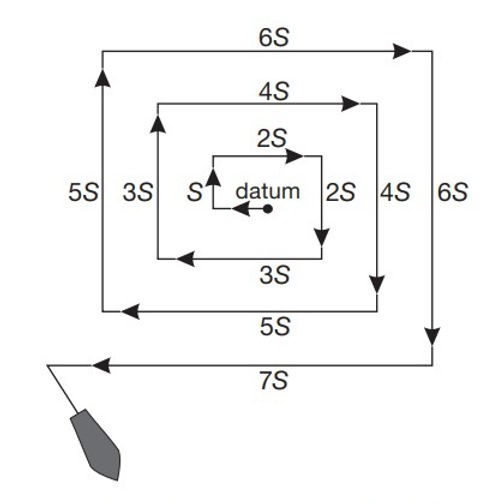
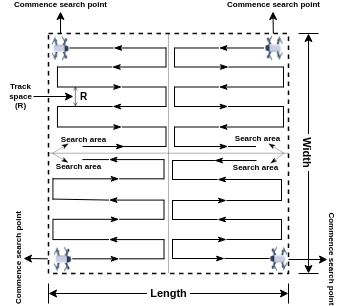
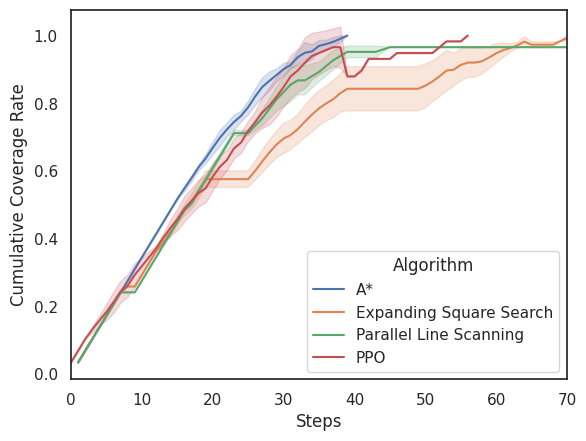

# Usando A* em problemas de CPP

??? "Atenção!"

    Teve algumas mudanças no enunciado do projeto, por favor, leia o enunciado completo para entender as mudanças. Elas estão em negrito para facilitar a identificação.

Problemas de *Coverage Path Planning* (CPP) são um tipo de problema de planejamento de caminhos onde o objetivo é encontrar um caminho que cubra uma área específica. O objetivo é garantir que todas as áreas sejam visitadas o mais rápido possível, o que é comum em tarefas como limpeza robótica, inspeção de áreas ou agricultura de precisão. Idealmente, o caminho encontrado deve evitar passar mais de uma vez em uma determinada área (célula) para minimizar o tempo e os recursos necessários para completar a tarefa.

**Algoritmos de busca em espaço de estados** são uma escolha possível para resolver esses problemas devido à sua eficiência e capacidade de encontrar uma sequência de ações que leve ao objetivo. No entanto, existem outros algoritmos que também são usados para resolver problemas de CPP, como o *Parallel Search* e *Expanding Square Search*. A forma de funcionamento do "Expanding Square Search" é apresentado na figura abaixo: 

Percebe-se que neste caso o agente começa a partir do centro da área e se move em um padrão de quadrado crescente, garantindo que todas as áreas sejam cobertas de maneira eficiente.

A forma de funcionamento do *Parallel Search* é apresentada na figura abaixo:

Nesta imagem é apresentado um cenário com múltiplos agentes que trabalham em paralelo para cobrir a área. Cada agente é responsável por uma parte específica da área, o que pode acelerar significativamente o processo de cobertura, especialmente em grandes áreas. No caso de um único agente, o funcionamento do *Parallel Search* é igual, mas sem a divisão de áreas entre múltiplos agentes.

A principal pergunta que este projeto deve responder é: "**Qual é o melhor algoritmo para resolver um problema de CPP?**" Para responder a essa pergunta, é necessário implementar e comparar **um dos algoritmos de busca em espaço de estados**, *Parallel Search* e *Expanding Square Search* em diferentes cenários de CPP, considerando fatores como o tamanho da área e a presença de obstáculos.

## Método

Para comparar os algoritmos, é necessário criar um ambiente de simulação onde cada algoritmo possa ser testado em cenários de CPP. Os cenários que serão testados serão dois: um ambiente $20 \times 20$ com 10% das células bloqueadas por obstáculos, e um ambiente $20 \times 20$ com **20%** das células bloqueadas por obstáculos. Para cada cenário, os algoritmos serão avaliados levando-se em consideração o *Cumulative Coverage Rate* (CCR), que é a taxa de cobertura acumulada ao longo do tempo. A cada ação do agente (*step*), o CCR é calculado e registrado, permitindo uma comparação detalhada do desempenho de cada algoritmo ao longo do tempo. Um exemplo de gráfico de CCR ao longo do tempo é apresentado abaixo:

Neste caso, o gráfico mostra a evolução do CCR para quatro algoritmos diferentes ao longo do tempo. O algoritmo que atinge um CCR mais alto mais rapidamente é considerado mais eficiente para o problema de CPP. Neste caso, percebe-se que o algoritmo A* (linha azul) atinge o valor de CCR igual a 1 (cobertura completa) mais rapidamente do que os outros algoritmos, indicando que ele é o mais eficiente para este cenário específico de CPP. E que o algoritmo *Parallel Search* (linha verde) nunca atingiu o valor de CCR igual a 1, indicando que ele não conseguiu cobrir toda a área, possivelmente devido à presença de obstáculos. 

O cálculo do CCR leva em consideração diversas medidas, por exemplo, 10 execuções. Para cada execução, o estado inicial do ambiente deve ser gerado aleatóriamente, garantindo que o ambiente tenha obstáculos distriuídos de maneira diferente a cada execução. No entanto, para garantir que todos os algoritmos sejam testados nas mesmas condições, o mesmo estado inicial deve ser usado para cada algoritmo em cada execução. Isso pode ser feito utilizando uma semente aleatória fixa para gerar o estado inicial do ambiente, garantindo que os obstáculos sejam colocados de maneira consistente em todas as execuções.

Desta forma, cada execução de cada algoritmo deve ter um limite máximo de ações (steps) para evitar que o agente fique preso em um loop infinito. A condição de *goal* do A* também precisa ser definida de maneira adequada para o problema de CPP, considerando que em determinados cenários o agente pode não conseguir cobrir toda a área devido à presença de obstáculos. 

A [questão 2 da avaliação intermediária](../../exercicios/2026_intermediaria/main_a.pdf) apresenta um cenário de CPP onde o agente deve encontrar um caminho para cobrir toda a área, evitando obstáculos. A equipe pode usar esta especificação para implementar o agente neste projeto. 

Para cada uma das duas configurações, além de medir o CCR, também será importante medir o tempo para cálculo da rota do algoritmo dos algoritmos. 

## Resultados esperados

Espera-se que ao final deste projeto, seja possível comparar o desempenho dos algoritmos **busca em espaço de estados (um deles)**, *Parallel Search* e *Expanding Square Search* em dois ambientes diferentes de CPP (dimensão $20 \times 20$ com 10% de obstáculos e dimensão $20 \times 20$ com **20%** de obstáculos). 

Espera-se que seja entregue um gráfico de CCR ao longo do tempo para cada cenário, permitindo uma comparação visual do desempenho dos algoritmos. Além disso, espera-se que seja informado o tempo médio (com o desvio padrão) para cálculo da rota de cada algoritmo em cada cenário.

Para facilitar a visualização do comportamento dos algoritmos, também é esperado que o ambiente de simulação tenha uma representação visual (por exemplo, em pygame), onde seja possível observar o caminho percorrido pelo agente e a cobertura da área ao longo do tempo. 

## Rubricas de avaliação

A avaliação deste projeto será baseada nos seguintes critérios:

- Implementação correta dos algoritmos **busca em espaço de estados (um deles)**, *Parallel Search* e *Expanding Square Search* (30 pontos)
- Geração adequada dos cenários de CPP com obstáculos (20 pontos)
- Cálculo correto do CCR ao longo do tempo (20 pontos)
- Relatório com análise e comparação dos resultados (20 pontos)
- Apresentação visual do ambiente de simulação (10 pontos)

## Entrega e formação de equipes

Todos os artefatos deste projeto devem ser entregues até o dia **15 de abril de 2026**. A entrega deve incluir o código-fonte da implementação, os gráficos de CCR ao longo do tempo e o relatório de análise dos resultados. Todas as entregas devem ser feitas via GitHub Classroom: [https://classroom.github.com/a/BhzwsCAU](https://classroom.github.com/a/BhzwsCAU).

As equipes podem ser formadas por até **3 integrantes**. 

## Detalhes sobre a implementação

A solução de um problema de CPP usando um algoritmo de busca em espaço de estados pode ser implementada de diversas maneiras, entre elas, usando a biblioteca `aigyminsper` ou implementando um algoritmo de busca do zero. Em ambos os casos, talvez seja necessário paralelizar a execução do algoritmo para acelerar o processo de busca, especialmente em cenários com muitos obstáculos. Outro desafio que pode aparecer é o estouro do limite de recursão da linguagem de programação Python, que pode ocorrer em algoritmos quando o ambiente é muito complexo. Para lidar com esse problema, é possível aumentar o limite de recursão usando a função `sys.setrecursionlimit()`, ou implementar o algoritmo de busca de maneira iterativa em vez de recursiva.

Abaixo é apresentado um vídeo que justifica alguma das mudanças no enunciado do projeto: 

* [Vídeo explicativo sobre as mudanças no enunciado do projeto](https://youtu.be/o7VmZxPCvZY)